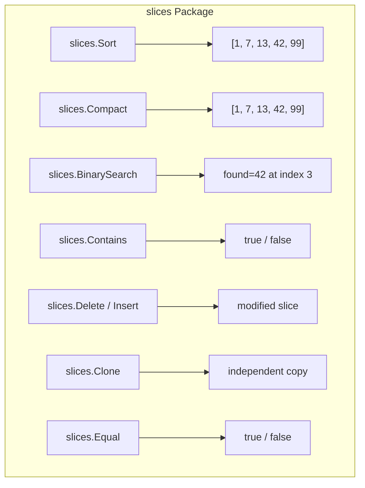

# DS.7 The slices package

## Mission

Master the `slices` package for type-safe slice operations including sorting, deduplication, searching, and modification.

## Prerequisites

- `DS.2` slices
- `DS.5` slice sharing and capacity

> [!NOTE]
> In [DS.2 Slices](../02-slices/README.md), you learned the basics of slice creation and manipulation. In [DS.5 Slices in Depth](../05-slices-2/README.md), you learned about shared backing arrays and aliasing. The `slices` package builds on this foundation with generic, type-safe operations.

## Mental Model

The `slices` package is like a **Swiss Army knife for slices**. Instead of writing manual loops for sorting, deduplication, or searching, you call a single function that works with any comparable or ordered type. Every function is generic — one `slices.Sort` works for `[]int`, `[]string`, or any custom ordered type.

## Visual Model



## Machine View

All `slices` functions are generic and use compile-time specialization. When you write `slices.Sort(nums)`, the Go compiler generates a type-specific sort implementation at compile time — there is no reflection or runtime dispatch. This means the performance is identical to hand-written type-specific code, but with none of the boilerplate.

## Run Instructions

```bash
go run ./02-language-basics/04-data-structures/07-slices
```

## Code Walkthrough

- **`slices.Sort`**: Sorts a slice in place using an optimized sort algorithm. Works with any ordered type.
- **`slices.Compact`**: Removes adjacent duplicates. The slice must be sorted first for full deduplication.
- **`slices.BinarySearch`**: Returns whether a value exists and its index. Requires a sorted slice.
- **`slices.Contains`**: Linear search that works with comparable types. Returns `true` if the value is present.
- **`slices.Delete`**: Removes elements from `i` to `j-1` efficiently by shifting remaining elements.
- **`slices.Insert`**: Grows a slice by inserting elements at a given index.
- **`slices.Clone`**: Creates an independent copy of a slice with its own backing array.
- **`slices.Equal`**: Compares two slices element-by-element for equality.

> [!TIP]
> These functions replace common patterns that previously required the `sort` package or manual loops. Now that you know the `slices` package, you'll use it in almost every Go program. Next, in [DS.8 maps](../08-maps/README.md), you'll learn the companion library for map operations.

## Try It

1. Create a slice of strings and sort it with `slices.Sort`. Then use `slices.Compact` on the result.
2. Use `slices.BinarySearch` on a sorted slice. What happens if you call it on an unsorted slice?
3. Use `slices.Clone` to make a copy and verify that modifying the copy does not affect the original.

## In Production

Production Go code uses the `slices` package for sorting API response data, deduplicating log entries, searching sorted configuration lists, and managing in-memory collections. Because the functions are generic, they eliminate entire categories of helper functions that teams used to maintain by hand.

## Thinking Questions

1. Why does `slices.Compact` only remove adjacent duplicates? How would you remove all duplicates regardless of position?
2. Why does `slices.BinarySearch` require a sorted slice? What happens if you pass an unsorted one?
3. How is `slices.Clone` different from assigning one slice variable to another (e.g., `copy := original`)?

## Next Step

Next: `DS.8` -> [`02-language-basics/04-data-structures/08-maps`](../08-maps/README.md)
