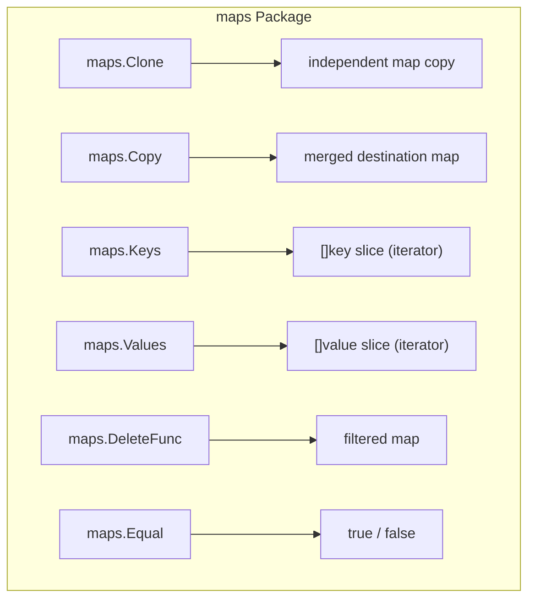

# DS.8 The maps package

## Mission

Master the `maps` package for generic map operations including cloning, merging, key/value extraction, and conditional deletion.

## Prerequisites

- `DS.3` maps
- `DS.7` slices (for understanding `slices.Collect`)

> [!NOTE]
> In [DS.3 Maps](../03-maps/README.md), you learned the basics of map creation, lookup, and iteration. In [DS.7 slices](../07-slices/README.md), you learned how the `slices` package provides generic operations. The `maps` package applies the same generic pattern to map types.

## Mental Model

The `maps` package provides tools for working with maps that eliminate boilerplate. Instead of writing a `for` loop every time you need to copy a map, merge one map into another, or collect all keys into a slice, you call a single generic function. Think of it as **map utilities that the standard library should have always had**.

## Visual Model



## Machine View

Generic operations are type-safe and compile-time checked. When you call `maps.Clone(myMap)`, the Go compiler specializes the function for the exact map type. There is no `interface{}` boxing or runtime type assertion. The generated code is as efficient as a hand-written loop, but with zero boilerplate.

## Run Instructions

```bash
go run ./02-language-basics/04-data-structures/08-maps
```

## Code Walkthrough

- **`maps.Clone`**: Creates a shallow, independent copy of a map. Modifying the original does not affect the clone.
- **`maps.Copy`**: Merges all key-value pairs from a source map into a destination map. Existing keys in the destination are overwritten.
- **`maps.Keys` / `maps.Values`**: Return iterators over the map's keys and values. Use `slices.Collect` to gather them into slices.
- **`maps.DeleteFunc`**: Removes entries where a callback function returns `true`. Useful for filtering maps without manual loops.
- **`maps.Equal`**: Compares two maps for identical key-value pairs. Returns `true` if they have the same keys with the same values.

> [!TIP]
> The `maps` package and `slices` package work together. For example, `maps.Keys` returns an iterator that you can collect with `slices.Collect`. This is the new idiomatic Go pattern for extracting and manipulating map contents. Next, in [FE.1 Functions Basics](../../../03-functions-errors/01-functions-basics/README.md), you'll move on to functions and error handling.

## Try It

1. Create a map, clone it with `maps.Clone`, and verify that adding a key to the original does not appear in the clone.
2. Use `maps.Copy` to merge two maps. What happens when both maps have the same key?
3. Use `maps.DeleteFunc` to remove all entries where the value is less than a threshold.

## In Production

`maps.Clone` is used for taking configuration snapshots before applying changes. `maps.Copy` is used for merging default configuration maps with user-provided overrides. `maps.DeleteFunc` is used for filtering sensitive entries from maps before serialization.

## Thinking Questions

1. Why does `maps.Clone` create a shallow copy? What types of values would require a deep copy?
2. How are `maps.Keys` iterators different from returning a slice directly? What are the memory benefits?
3. Why does `maps.Equal` use deep comparison of values? What types of map values cannot be compared?

## Next Step

Next: `FE.1` -> [`03-functions-errors/01-functions-basics`](../../../03-functions-errors/01-functions-basics/README.md)
