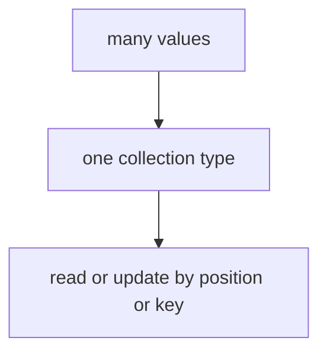

# DS.1 Arrays

## Mission

Learn what an array is in Go and why arrays matter even though slices become the more common tool later.

This lesson exists because arrays make one important rule visible early:

- fixed-size values are copied by value

That rule helps the learner understand slices by contrast in the next lesson.

## Why This Lesson Exists Now

After learning control flow (if, for, switch), the next question is: "How do I work with groups of values?"

The learner already knows single values. Now they need to understand what happens when there are multiple values together.

Arrays are the foundation for this. They show that Go has fixed-size collections, which introduces the critical concept: what gets copied and what gets shared.

> **Backward Reference:** In the final Control Flow lesson, [Lesson 7: Pricing Checkout](../../03-control-flow/7-pricing-checkout/README.md), you iterated over a slice of items. Before we dive into dynamic slices, we must first understand the fundamental fixed-size Array that sits underneath them.

## Prerequisites

- Section entry for `02-language-basics/04-data-structures`
- Comfortable with `CF.2` for basics (loops)

## Mental Model

An array is a fixed-size value.
Its size is part of its type, and copying an array copies all of its elements.

## Visual Model


```text
numbers := [2]int{1, 2}

index:   0   1
value:   1   2
```

```text
original = [10 20 30]
copied   = original

change copied[0] -> 99

original = [10 20 30]
copied   = [99 20 30]
```

## Machine View

When you declare an array in Go, the compiler allocates enough memory for all elements.

An array variable contains the actual values, not a reference to them.

When you copy an array with `copied := original`, Go copies every element from the original to the new location in memory.

This is different from languages that use references. Here, two variables mean two independent copies.

## Run Instructions

```bash
go run ./02-language-basics/04-data-structures/1-array
```

## Code Walkthrough

### `import "fmt"`

This lesson prints values to the terminal, so it imports the formatting package.

### `fmt.Println("=== Arrays ===")`

The first print gives the lesson output a clear starting label.

### `var numbers [2]int`

This line declares an array named `numbers`.

Important details:

- `[2]int` means "an array with exactly two `int` values"
- the `2` is not only a size hint; it is part of the type
- `[2]int` and `[3]int` are different types

### `fmt.Printf("Zero value array: %v\n", numbers)`

This prints the zero value of the array.
Because the array holds `int` values, the zero value is `[0 0]`.

### `numbers[0] = 1` and `numbers[1] = 2`

These two lines update the array by index.
The valid indices are `0` and `1` because the array length is `2`.

### `primes := [4]int{2, 3, 5, 7}`

This line shows an array literal.
Instead of declaring and then assigning one element at a time, the code creates the whole array in
one step.

### `for i, value := range primes`

This loop walks over the array.

- `i` is the index
- `value` is the copied value at that position

This is the first reminder that iteration gives you access to both position and value.

### `original := [3]int{10, 20, 30}`

This creates the first array for the copy demonstration.

### `copied := original`

This is the key line in the lesson.
Go copies the whole array here.

After this line:

- `copied` has the same contents as `original`
- `copied` is not another name for `original`
- changing `copied` does not change `original`

### `copied[0] = 99`

This updates only the copied array.

### The final two `Printf` lines

These prove that the original array stayed `[10 20 30]` while the copied array became
`[99 20 30]`.

That is the real lesson outcome.

> **Forward Reference:** Now that you understand that Arrays are fixed-size and copy-by-value, you will see exactly why Go provides a more dynamic tool for everyday use in the next lesson, [Lesson 2: Slices](../2-slices/README.md).

## Try It

1. Change `var numbers [2]int` to `var numbers [3]int` and add one more assignment.
2. Change `copied[0] = 99` to `original[0] = 99` and run the lesson again.
3. Try declaring `other := [2]int{1, 2}` and compare it mentally with `[3]int{1, 2, 3}`.

## Common Questions

- Why teach arrays if slices are more common?
  Arrays make value-copy behavior obvious, which helps the next slice lesson make sense.

- Why are `[2]int` and `[3]int` different?
  Because array size is part of the type in Go.

## In Production
You will not model most dynamic collections with arrays, but the value-copy rule matters whenever
you reason about what gets copied and what stays shared.

## Thinking Questions
1. What problem is this lesson trying to solve?
2. What would change if you removed this idea from the program?
3. Where do you expect to see this pattern again in real Go code?
## Next Step

Next: `DS.2` -> `02-language-basics/04-data-structures/2-slices`

Open `02-language-basics/04-data-structures/2-slices/README.md` to continue.
