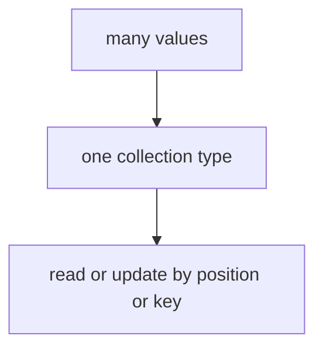

# DS.3 Maps

## Mission

Learn how Go performs keyed lookup with maps and why the comma-ok pattern matters whenever a missing key would otherwise be ambiguous.

## Why This Lesson Exists Now

So far you have learned about sequential data (arrays, slices). But sometimes you need to find things by name or ID, not by position.

Maps solve exactly that problem: fast lookup by key instead of scanning from the start.

This lesson builds on DS.2 by adding the ability to organize data by keys.

> **Backward Reference:** In [Lesson 2: Slices](../2-slices/README.md), you learned how to store dynamic sequences of items accessed by numeric index. Maps complement slices by allowing you to store and retrieve data using semantic keys (like strings).

## Prerequisites

- `DS.2` slices

## Mental Model

A map connects keys to values.
Use it when finding something by name, ID, or label matters more than keeping items in order.

## Visual Model


```text
studentGrades

"Alice" -> 95
"James" -> 85
"Mary"  -> 88
```

```text
lookup rules

existing key -> value + exists=true
missing key  -> zero value + exists=false
```

## Machine View

A map in Go is a hash table. When you store a key-value pair, Go computes a hash of the key and stores the data at that location.

When you look up a key, Go computes the same hash and retrieves the value.

If a key does not exist, looking it up returns the zero value for the value type (0 for int, "" for string, etc.). This is why the comma-ok pattern exists: to distinguish between a missing key and a key whose value happens to be zero.

## Run Instructions

```bash
go run ./02-language-basics/04-data-structures/3-maps
```

## Code Walkthrough

### `studentGrades := map[string]int{ ... }`

This line creates a map literal.

Important parts:

- keys are `string`
- values are `int`
- each key maps to one value

### `studentGrades["Alice"] = 95`

This updates an existing key.

### `studentGrades["Mary"] = 88`

This adds a new key-value pair.

These two lines show that the same bracket syntax handles both update and insert.

### `studentGrades["Zack"]`

This line reads a key that does not exist.
Go returns the zero value of the value type, which is `0` here.

That is useful, but also dangerous when `0` could be a real value.

### `aliceScore, aliceExists := studentGrades["Alice"]`

This is the comma-ok pattern.

It answers two questions at once:

- what is the value?
- did the key really exist?

### `zackScore, zackExists := studentGrades["Zack"]`

This repeats the same pattern for a missing key so the learner can compare the results honestly.

### `delete(studentGrades, "Dan")`

This removes a key from the map.

### `settings := make(map[string]string)`

This creates an empty map that can be filled later.
Use `make` when the map should start empty and grow step by step.

## Try It

1. Add another student and print the map again.
2. Read a missing key without comma-ok, then with comma-ok, and compare the difference.
3. Delete a key that is already missing and notice that Go stays calm.

## Common Questions

- Why not use a slice for grades?
  A slice is best when position and order matter. A map is best when lookup by key matters.

- Why is comma-ok important?
  Because a missing key returns the zero value, and that can look like a real stored value.

## In Production
Maps appear constantly in Go for configuration, lookup tables, indexing, request classification,
and in-memory caches. The comma-ok habit prevents subtle bugs around missing data.

## Thinking Questions
1. What problem is this lesson trying to solve?
2. What would change if you removed this idea from the program?
3. Where do you expect to see this pattern again in real Go code?

> **Forward Reference:** Data structures store values, but to share those values efficiently across your program without constantly copying them, you need to understand memory addresses. In the next lesson, [Lesson 4: Pointers](../4-pointers/README.md), you will learn how to reference memory directly.

## Next Step

Continue to `DS.4` pointers.
