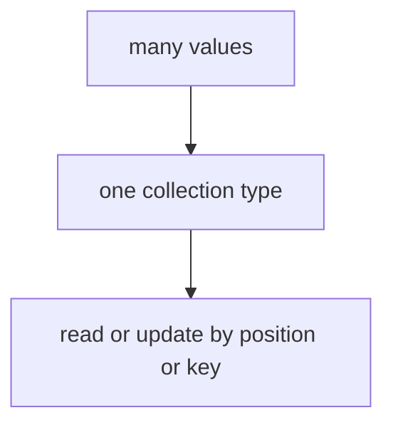

# DS.4 Pointers

## Mission

Learn what a pointer is, how dereferencing works, and why pointers matter when an update must change the original stored value rather than only a copy.

## Why This Lesson Exists Now

You have learned about arrays, slices, and maps. But there is still a gap: how do you share data between parts of your program so that updates are visible everywhere?

That is what pointers solve. When you pass a slice to a function, you are passing a reference. But for single values or when you need explicit sharing, pointers are the tool.

This lesson builds on DS.1 (arrays as value types) and DS.2 (slices as references) to complete the picture.

> **Backward Reference:** In [Lesson 3: Maps](../3-maps/README.md), you learned how to use a built-in reference type (map) to look up values by key. Now we will look under the hood at how you can create your own references to any value using pointers.

## Prerequisites

- `DS.1` arrays
- `DS.2` slices

## Mental Model

A pointer stores the address of a value.
You use it when you need to reach the original value and update it directly.

## Visual Model


```text
score    = 50
scorePtr = &score

scorePtr --> score
```

```text
*scorePtr = 95

pointer follows the address
and updates the original stored value
```

```text
phones := []string{"111-2222", "333-4444", "555-6666"}
bobPhone := &phones[1]

bobPhone --> phones[1]
```

## Machine View

A pointer is a variable that stores a memory address. In Go, the zero value for a pointer is `nil`, meaning it points to nothing.

When you use `&` (address-of operator), you get a pointer to the variable. When you use `*` (dereference operator), you access the value stored at that address.

Unlike some languages, Go does not allow pointer arithmetic. This keeps Go safe and simple. You can only:
- Take the address of a variable
- Follow that address to read or write the value

Slices already contain a pointer (to their backing array), which is why they can be passed to functions and have changes visible. This lesson shows you the same pattern for single values.

## Run Instructions

```bash
go run ./02-language-basics/04-data-structures/4-pointers
```

## Code Walkthrough

### `score := 50`

This creates the original integer value.

### `scorePtr := &score`

`&score` means "the address of `score`."
This line creates a pointer that points at the original variable.

### The first `Printf` group

These lines print:

- the value in `score`
- the address of `score`
- the pointer value
- the value reached by dereferencing the pointer

`*scorePtr` means "go to the value stored at this address."

### `scoreCopy := score`

This copies the integer value.
It does not create another pointer.

### `scoreCopy = 95`

This changes only the copied value.
That is why the original `score` stays unchanged at that moment.

### `*scorePtr = 95`

This is the key pointer line in the lesson.

It means:

- go to the original value through the pointer
- change that original value directly

That is why `score` changes after this line.

### `phones := []string{...}`

This creates a slice so the lesson can connect pointers to stored collection elements.

### `bobPhone := &phones[1]`

This takes the address of the second phone number inside the slice.

That matters for the milestone because later the contact-directory exercise updates one stored phone
value through a pointer.

### `*bobPhone = "333-9999"`

This updates the slice element through the pointer.
The final print proves the stored slice data changed.

### `var optionalScore *int`

This declares a pointer whose zero value is `nil`.

### `if optionalScore == nil`

This is the safety check.
Dereferencing a nil pointer would panic, so the lesson shows the right habit first:

- check before dereferencing when nil is possible

## Try It

1. Change `scoreCopy = 95` to another number and confirm that `score` still does not change.
2. Change `*scorePtr = 95` to a different number and watch the original update again.
3. Point at a different slice element, like `&phones[0]`, and update that instead.

## Common Questions

- Why not use pointers everywhere?
  Because many values do not need shared mutation. Use pointers when the original value must be
  reached directly.

- Why show a slice element pointer here?
Because `04-data-structures` ends with a milestone that updates stored slice data through a
pointer.

## In Production
Pointers matter whenever a Go program must mutate stored state intentionally and safely. They also
help learners stop confusing "copied value" with "original value."

## Thinking Questions
1. What problem is this lesson trying to solve?
2. What would change if you removed this idea from the program?
3. Where do you expect to see this pattern again in real Go code?

> **Forward Reference:** You've now seen arrays, slices, maps, and pointers. In the next lesson, [Lesson 5: Slices 2](../5-slices-2/README.md), we will combine these concepts to show what happens when multiple slices share the same underlying memory via pointers.

## Next Step

Continue to `DS.5` slice sharing and capacity.
