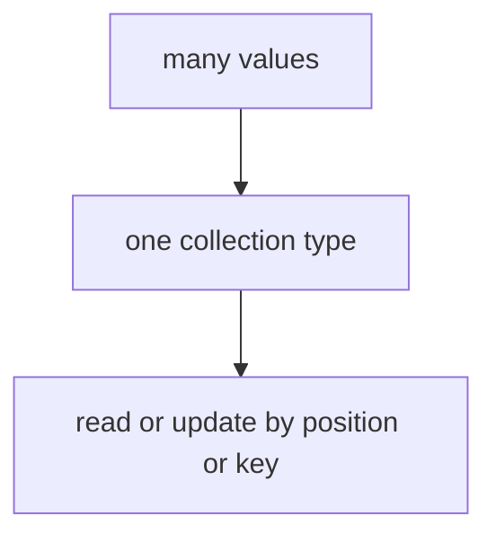

# DS.5 Slice Sharing And Capacity

## Mission

Learn why sub-slices can still affect the original data and why `append` can reuse spare capacity in ways that surprise beginners.

## Why This Lesson Exists Now

You now know how to create slices and how they work. But there is a subtle trap: when you create a sub-slice, it might still share the same backing array as the original.

This matters because changing data through one slice can unexpectedly change another. This is the "gotcha" that catches many Go learners.

This lesson builds on DS.2 (slices) and DS.4 (pointers) by showing the connection between slice headers and shared backing arrays.

> **Backward Reference:** In [Lesson 2: Slices](../2-slices/README.md), you learned the basics of slice creation and appending. In [Lesson 4: Pointers](../4-pointers/README.md), you learned how multiple variables can reference the same memory. Now we combine these concepts to show how sub-slices can unintentionally share underlying arrays.

## Prerequisites

- `DS.2` slices
- `DS.4` pointers

## Mental Model

A sub-slice is usually another view over the same backing array.
That makes slicing cheap, but it also means two slices can still touch the same stored data.

## Visual Model


```text
original := [0 1 2 3 4 5]
shared   := original[1:4]

original: 0 1 2 3 4 5
shared:     1 2 3
```

```text
shared[0] = 100

original: 0 100 2 3 4 5
shared:     100 2 3
```

```text
growth := original[2:4]
append may still write into the original backing array
if spare capacity exists
```

## Machine View

When you create a slice with `original[1:4]`, you are not copying the data. You are creating a new slice header that points to the same backing array.

Both slices share the same underlying array. Modifying one affects the other.

However, when `append` exceeds the original slice's capacity, Go allocates a new backing array and copies the data. After that point, the connection is broken.

This is why understanding capacity matters: if you are working with slices derived from the same source, you might be sharing memory unintentionally.

## Run Instructions

```bash
go run ./02-language-basics/04-data-structures/5-slices-2
```

## Code Walkthrough

### `original := []int{0, 1, 2, 3, 4, 5}`

This creates the base slice that the rest of the lesson will inspect.

### `shared := original[1:4]`

This creates a sub-slice view.
It does not copy values into a separate collection.

### `len(shared)` and `cap(shared)`

The lesson prints both measurements so the learner can see that a sub-slice may have:

- a smaller length
- but still a larger capacity than expected

That spare capacity is what makes later `append` behavior surprising.

### `shared[0] = 100`

This changes the first visible element of `shared`.
Because `shared` and `original` still share the same backing array, `original` changes too.

That is the first big warning in the lesson:

- a new slice view is not the same as a copied slice

### `growth := original[2:4]`

This creates another sub-slice to demonstrate append behavior.

### `growth = append(growth, 200)`

This is the second big warning.

If the append fits inside the available capacity, Go can reuse the backing array.
That means the append can overwrite part of the original data.

The next print proves that the original slice changed.

### `independent := make([]int, len(original[2:4]))`

This line starts the safe copy approach.
Instead of sharing, the code allocates a new slice with its own backing storage.

### `copy(independent, original[2:4])`

This built-in function copies elements from the source slice into the destination slice.
Because it is a new independent backing array, changes to one will not affect the other.

### `independent[0] = 500`

This final mutation proves the new slice no longer shares storage with the original.

## Try It

1. Change the sub-slice ranges and watch how `len` and `cap` change.
2. Append more than one value to `growth` and inspect whether the original still changes.
3. Change the manual copy loop to copy a different slice range and confirm the independent slice
   stays separate.

## Common Questions

- Why did `append` change the original slice?
  Because the sub-slice still had spare capacity in the same backing array.

- How do I avoid accidental sharing?
  Copy the values into a new slice before making independent changes.

## In Production
This lesson prevents one of the most common slice bugs in Go: changing shared data accidentally
because two slices still point at the same backing array.

## Thinking Questions
1. What problem is this lesson trying to solve?
2. What would change if you removed this idea from the program?
3. Where do you expect to see this pattern again in real Go code?

> **Forward Reference:** Now that you understand the mechanics and edge cases of arrays, slices, maps, and pointers, it's time to put them together. In the final lesson of this section, [Lesson 6: Contact Manager](../6-contact-manager/README.md), you will use all of these structures to build a working, composite data model.

## Next Step

Next: `DS.6` -> `02-language-basics/04-data-structures/6-contact-manager`

Open `02-language-basics/04-data-structures/6-contact-manager/README.md` to continue.
