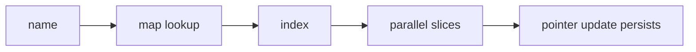

# DS.6 Contact Directory

## Mission

Build a small in-memory contact directory that combines slices, maps, and pointers in one runnable milestone.

## Why This Lesson Exists Now

You have learned all the core pieces of basic Go data handling: arrays, slices, maps, and pointers.

This lesson exists to combine them. By building a small contact directory, you will prove to yourself that you understand how a map can provide $O(1)$ key lookup for an index, how that index retrieves structured data from parallel slices, and how a pointer allows you to update that stored data directly.

> **Backward Reference:** In [Lesson 5: Slices 2](../5-slices-2/README.md), you learned how memory sharing can be dangerous. In this exercise, you will intentionally use pointers (from [Lesson 4](../4-pointers/README.md)) and maps (from [Lesson 3](../3-maps/README.md)) to manage memory explicitly and safely.

## Prerequisites

- `DS.1` arrays
- `DS.2` slices
- `DS.3` maps
- `DS.4` pointers
- `DS.5` slice sharing and capacity

## Mental Model

This exercise uses three data-structure roles together:

- slices store ordered contact data
- a map turns names into positions
- a pointer updates a stored value in place

The point is not realistic app architecture yet. The point is understanding how these structures cooperate.

## Visual Model



## Machine View

Slices hold backing arrays plus length and capacity metadata. The map stores indexes into those slices. When the code takes `&phones[index]`, it gets a direct reference to an element in the slice's underlying storage and mutates it in place.

## Run Instructions

```bash
go run ./02-language-basics/04-data-structures/6-contact-manager
go run ./02-language-basics/04-data-structures/6-contact-manager/_starter
go test ./02-language-basics/04-data-structures/6-contact-manager
```

## Solution Walkthrough

### Parallel slices

The solution stores names, emails, and phone numbers in separate slices that must stay index-aligned.

### `indexByName map[string]int`

The map answers "where is this contact?" quickly by storing the slice index for each name.

### Appending new contacts

Each new contact appends to all slices, then stores the new last index in the map.

### Duplicate protection

The comma-ok map lookup guards against accidentally creating the same contact twice.

### Pointer-based update

The important milestone step is taking a pointer to a slice element and proving that the update persists after the write.

## Try It

1. Add another contact and update the map with the correct index.
2. Change the pointer-based update from Bob to another contact.
3. Intentionally break slice alignment and explain why the output becomes wrong.

## Verification Surface

```bash
go run ./02-language-basics/04-data-structures/6-contact-manager
go run ./02-language-basics/04-data-structures/6-contact-manager/_starter
go test ./02-language-basics/04-data-structures/6-contact-manager
```

## In Production
Real systems constantly combine indexed storage, keyed lookup, and in-place mutation. Understanding how those pieces interact is what keeps updates correct and shared state understandable.

## Thinking Questions
1. Why does the map store indexes instead of the phone numbers directly?
2. What invariant must stay true for the parallel slices to remain correct?
3. Why does updating through a pointer change the stored slice value?

> **Forward Reference:** In this module, we used "parallel slices" (one for names, one for emails, one for phones) because you don't know how to create custom types yet. That is cumbersome. In the next section, [Functions & Errors](../../../03-functions-errors/1-functions-basics/README.md), you will learn how to encapsulate logic so that when we eventually introduce structs, your programs become significantly cleaner.

## Next Step

Continue to `FE.1` functions basics.
