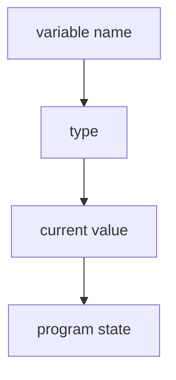

# LB.1 Variables

## Mission

Learn how Go declares variables and why every type has a predictable zero value.

## Prerequisites

- `GT.4` development environment

## Mental Model

A variable is a named slot that holds a value while the program runs.

Go gives you three common declaration shapes:

1. `var name string`
2. `var name = "value"`
3. `name := "value"`

Every declared variable also starts in a known zero state.

## Visual Model



## Machine View

When a variable is declared, Go reserves space for a value of that type and initializes it to the type's zero value. That guarantee prevents the undefined garbage-state behavior seen in lower-level languages.

## Run Instructions

```bash
go run ./02-language-basics/1-variables
```

## Code Walkthrough

### `var greeting string`

This declares a string variable explicitly. Its initial value is the zero value, `""`.

### `greeting = "Hello, world!"`

This assignment changes the stored value after declaration.

### `var count int` and `var isRunning bool`

These lines show that zero values depend on type: `0` for `int`, `false` for `bool`.

### `firstName, lastName := "John", "Doe"`

Short declaration creates local variables and lets the compiler infer their types.

### Unused variable rule

Go refuses to compile code with unused local variables. That catches mistakes early.

> **Forward Reference:** You will learn more about how the compiler strictly enforces code quality in [Lesson 08: Quality and Test](../../08-quality-test/README.md).

## Try It

1. Change one assigned value and rerun the lesson.
2. Add a new variable using short declaration.
3. Declare a variable and leave it unused to see the compiler error.

## In Production
Predictable variable initialization is one of the reasons Go code is easier to reason about under pressure. Zero values, explicit types, and compile-time unused-variable errors reduce hidden state and dead code.

## Thinking Questions
1. Why is a guaranteed zero value safer than leaving memory uninitialized?
2. When might explicit `var` be clearer than `:=`?
3. Why would the compiler reject unused local variables?

## Next Step

Continue to `LB.2` constants.
