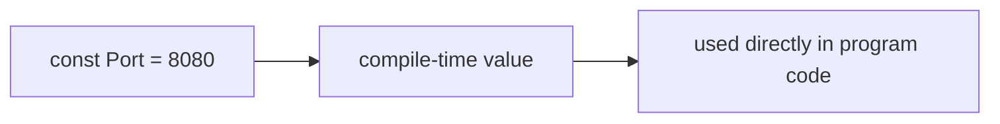

# LB.2 Constants

## Mission

Learn how Go represents values that should never change at runtime.

## Prerequisites

- `LB.1` variables

## Mental Model

A variable can change while the program runs. A constant cannot.

> **Backward Reference:** You already learned how variables hold mutable state in [Lesson 1: Variables](../1-variables/README.md). Constants provide the immutable counterpart.

Constants communicate:

- this value is fixed by design
- the compiler can treat it as compile-time data

## Visual Model



## Machine View

Go constants are compile-time values. The compiler can inline them where they are used instead of treating them like mutable runtime storage.

## Run Instructions

```bash
go run ./02-language-basics/2-constants
```

## Code Walkthrough

### `const Host = "127.0.0.1"`

This declares a simple string constant with an inferred type.

### `const pi float64 = 3.1415926`

This shows that constants can also be declared with an explicit type.

### `const ( ... )`

Grouped constants keep related values together and easier to scan.

> **Forward Reference:** We will expand on grouped constants by introducing the `iota` keyword to create true enumerations in [Lesson 3: Enums](../3-enums/README.md).

### Attempted reassignment

If you try to change a constant, the compiler stops you before the program can run.

## Try It

1. Change one constant value and rerun the lesson.
2. Add another constant inside the grouped block.
3. Try to reassign a constant and read the compiler error.

## In Production
Constants are where teams encode stable facts: protocol values, configuration keys, fixed messages, and sentinel sizes. Making those values immutable prevents accidental runtime drift.

## Thinking Questions
1. Why is "should never change" worth expressing in the type system and compiler rules?
2. When is a constant clearer than a package-level variable?
3. What bugs become harder to write when fixed values are immutable?

## Next Step

Continue to `LB.3` enums with iota.
