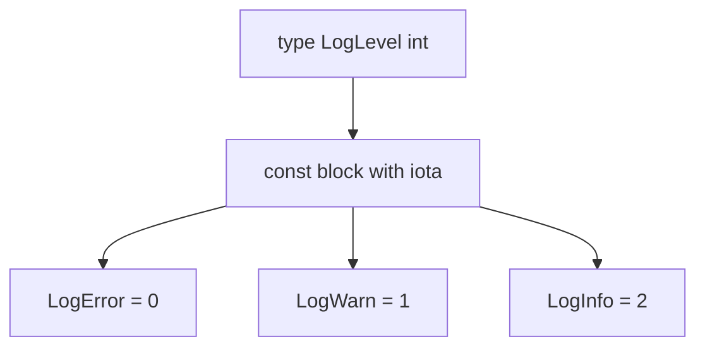

# LB.3 Enums with Iota

## Mission

Learn how Go models enum-like values with named types and `iota`.

## Prerequisites

- `LB.2` constants

## Mental Model

Go does not have an `enum` keyword. Instead, it combines:

- a named type
- a `const` block
- `iota` for ordered values

That gives you fixed related values with type safety.

> **Backward Reference:** In [Lesson 2: Constants](../2-constants/README.md), we learned how grouped constants group related static values. Here we combine that with named types to simulate the missing enum structure.

## Visual Model



## Machine View

`iota` generates sequential constant values during compilation. Wrapping those values in a named type lets the compiler distinguish a `LogLevel` from an ordinary `int`.

## Run Instructions

```bash
go run ./02-language-basics/3-enums
```

## Code Walkthrough

### `type LogLevel int`

This creates a distinct named type backed by `int`.

### `const ( ... = iota )`

Inside the block, `iota` starts at `0` and increments by one for each new constant line.

### `iota + 1`

This pattern is useful when `0` should mean "unset" or "invalid" instead of a real value.

### `func (l LogLevel) String() string`

The method converts numeric enum values into readable text for output and debugging.

> **Forward Reference:** We will put this precise pattern into practice in the next exercise, [Lesson 4: Application Logger](../4-application-logger/README.md), where we will use our `LogLevel` enum to control what gets printed.

## Try It

1. Add another enum value and watch `iota` keep counting.
2. Create a second named type with its own `const` block.
3. Print an invalid enum value and inspect the fallback text.

## In Production
Named enum-like values show up everywhere in Go code: log levels, modes, categories, states, and protocol values. The combination of `iota`, named types, and string conversion keeps those values readable and hard to misuse.

## Thinking Questions
1. Why is a named type safer than using raw integers for categories?
2. When is `iota + 1` a better choice than plain `iota`?
3. Why is a `String()` method helpful even though the underlying value is still numeric?

## Next Step

Next: `LB.4` -> `02-language-basics/4-application-logger`

Open `02-language-basics/4-application-logger/README.md` to continue.
