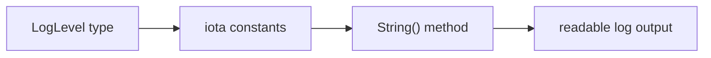

# LB.4 Application Logger

## Mission

Build a small logger that combines variables, constants, `iota`, and methods into one readable program.

## Prerequisites

- `LB.1` variables
- `LB.2` constants
- `LB.3` enums with `iota`

## Mental Model

This exercise turns separate language pieces into one compact system:

- a named type models the log level
- `iota` creates ordered constants
- a method converts internal numeric values into readable output

That is the first taste of composing simple ideas into one useful artifact.

> **Backward Reference:** This exercise directly combines the core language components from [Lesson 1: Variables](../1-variables/README.md), [Lesson 2: Constants](../2-constants/README.md), and [Lesson 3: Enums](../3-enums/README.md).

## Visual Model



## Machine View

At runtime, the program stores log levels as small integers. The `String()` method translates those integers into human-readable names before printing, and the bounds check prevents invalid indexes from crashing the program.

## Run Instructions

```bash
go run ./02-language-basics/4-application-logger
go run ./02-language-basics/4-application-logger/_starter
```

## Solution Walkthrough

### `type LogLevel int`

The solution creates a named type so log levels are more meaningful than raw integers.

### `const ( ... LogLevel = iota )`

This block assigns stable numeric values to each log level in order.

### `var levelNames = []string{...}`

The slice maps each numeric level to the text the program wants to display.

### `func (l LogLevel) String() string`

The method checks bounds first, then returns the matching human-friendly name.

### `printLogLevel(...)`

This helper centralizes how a level is shown in output, keeping `main()` simple.

> **Forward Reference:** Now that we have established a foundation of types and variables, we will use them to build branching logic. Proceed to the next section to learn control flow structures in [Control Flow: if-else](../03-control-flow/1-if-else/README.md).

## Try It

1. Add another log level and its display name.
2. Print an invalid log level like `99` and inspect the fallback.
3. Change the output format inside `printLogLevel`.

## Verification Surface

```bash
go run ./02-language-basics/4-application-logger
go run ./02-language-basics/4-application-logger/_starter
```

Expected output should show readable level names and a safe fallback for invalid input.

## In Production
Enum-like log levels are everywhere in services and tooling. Good logging systems depend on stable internal values and readable external text, especially when alerts and dashboards consume those levels downstream.

## Thinking Questions
1. Why is it useful to separate the stored level value from the displayed level name?
2. What bug does the bounds check inside `String()` prevent?
3. Why is this exercise a better milestone than printing raw integers?

## Next Step

Continue to `CF.1` if / else.
