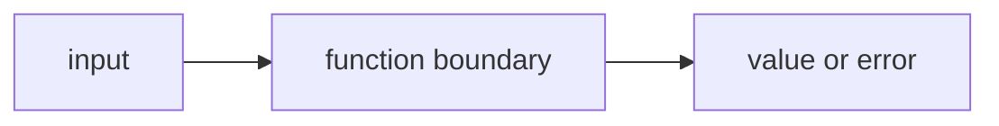

# FE.1 Functions Basics

## Mission

Learn what a function boundary is and why naming a piece of work is better than leaving everything inline in `main()`.

## Why This Lesson Exists Now

After learning about data structures (arrays, slices, maps, pointers), you have been storing and organizing data. But you still need to organize the code that works with that data.

The next question is: "How do I break my program into reusable pieces?"

That is what functions do. They let you name a block of code and call it from different places.

> **Backward Reference:** In the previous module, [Data Structures](../../02-language-basics/04-data-structures/README.md), you learned how to organize data into slices and maps. Now, you will learn how to organize the logic that operates on that data into discrete, named functions.

## Prerequisites

- `DS.6` contact directory

## Mental Model

A function gives a piece of work a name.

Instead of keeping every step directly in `main()`, you move one small responsibility into a
separate function and let `main()` ask for that work when it needs it.

## Visual Model


```text
main()
  |
  +--> printBanner()
  |
  +--> printGoal()
  |
  +--> printChecklist()
```

```text
main stays readable

instead of:
line
line
line
line
line

you get:
main() -> named steps
```

## Machine View

When `main()` calls another function, Go pauses `main()` at that line, starts running the called
function, and then returns to the next line in `main()` when that function finishes.

At this stage, the important machine truth is simple:

- control jumps into the function body
- the function runs its own lines in order
- control returns to the caller when the function ends

You do **not** need to think about exact RAM usage here.
What matters first is understanding the flow of execution.

## Run Instructions

```bash
go run ./03-functions-errors/1-functions-basics
```

## Code Walkthrough

### `func printBanner() {`

This line defines a function named `printBanner`.

- `func` means "we are declaring a function"
- `printBanner` is the function name
- `()` is empty here because this function does not need any input yet

### `fmt.Println("=== Functions Basics ===")`

This line is the work done by `printBanner`.

Right now the job is intentionally small: print one clear heading.

### `func printGoal() {`

This second function shows the same shape again.
That repetition is useful because the learner sees that functions are not special one-off tricks.
They are normal named blocks of work.

### `func printChecklist() {`

This function prints several lines, which makes one more important point:

- a function can hold one line
- or several related lines

The real question is not "how many lines are allowed?"
The real question is "does this block do one recognizable job?"

### `func main() {`

`main()` is still the entry point.
The difference now is that `main()` does not carry every print statement directly.

### `printBanner()`

This line calls the function.

The `()` matters.
Without it, you are naming the function.
With it, you are asking Go to run the function.

### `printGoal()`

This line shows that `main()` can call another named step immediately after the first one.

That is the first taste of structured program flow through functions.

### `printChecklist()`

This finishes the small program with another named step.
The important thing is not the printed text.
The important thing is that `main()` now reads like a short list of jobs.

## Try It

1. Rename `printGoal` to `printMission` and update the call in `main()`.
2. Add one more function called `printNextStep()` and call it from `main()`.
3. Move one line out of `printChecklist()` back into `main()` and compare readability.

## Common Questions

- Why use a function if it only prints one line?
  Because the lesson is about naming a job first. Later lessons will make the job more useful.

- Does a function always need input?
  No. Some functions only perform one fixed action.

## In Production
Real programs become hard to read when every action stays inline.
Small named functions are the first step toward readable application flow.

## Thinking Questions
1. What problem is this lesson trying to solve?
2. What would change if you removed this idea from the program?
3. Where do you expect to see this pattern again in real Go code?

> **Forward Reference:** This lesson taught you how to move a block of code into a named function, but the functions didn't take any data or return any answers. In the next lesson, [Lesson 2: Parameters and Returns](../2-parameters-and-returns/README.md), you will learn how to pass data across the function boundary.

## Next Step

Continue to `FE.2` parameters and returns.
