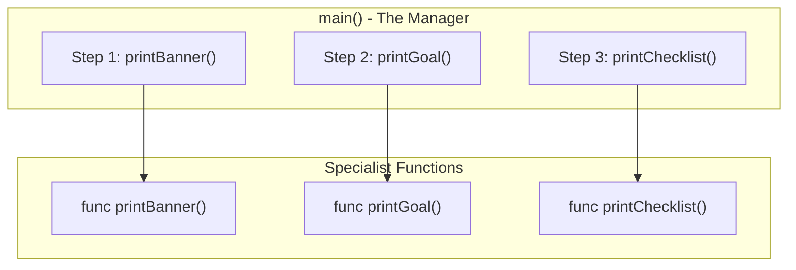

# FE.1 Functions Basics

## Mission

Learn what a function boundary is and why naming a piece of work is better than leaving everything inline in `main()`.

## Prerequisites

- `DS.6` contact manager (milestone)

## Mental Model

A function gives a specific piece of work a **Name**.

Instead of keeping every step directly in `main()`, you move one small responsibility into a separate function. This makes your code more readable, maintainable, and reusable. Think of `main()` as a "Manager" that calls upon different "Specialists" (functions) to get things done.

> [!NOTE]
> In the previous track, [Data Structures](../../02-language-basics/04-data-structures/README.md), you learned how to organize data into slices and maps. Now, you will learn how to organize the **behavior** that operates on that data into discrete, named functions.

## Visual Model



## Machine View

When the CPU executes a function call like `printBanner()`, it performs a **Jump** instruction.
1. The CPU "saves" the current position in `main`.
2. It jumps to the memory address where the `printBanner` instructions are stored.
3. It runs those instructions line by line.
4. When it hits the closing brace `}`, it jumps back to the exact spot it left off in `main`.

## Run Instructions

```bash
go run ./03-functions-errors/1-functions-basics
```

## Code Walkthrough

- **`func` keyword**: Used to declare a new function.
- **`printBanner()`**: The name of the function. The `()` are for parameters (none yet).
- **Function Body `{ ... }`**: The block of code that runs when the function is called.
- **Calling the function**: In `main()`, we write `printBanner()` to trigger the jump and execute the code.

> [!TIP]
> This lesson taught you how to move code into a named function, but these functions didn't take any data or return any answers. In [FE.2 Parameters and Returns](../2-parameters-and-returns/README.md), you will learn how to pass data across the function boundary.

## Try It

1. In `main.go`, rename `printGoal` to `printMission` and update the call in `main()`.
2. Add a new function `func printSuccess()` that prints a celebratory message and call it at the end of `main()`.
3. Try calling `printBanner()` twice in `main()`. What happens?

## In Production

In professional Go code, we aim for "Single Responsibility". Each function should do one thing and do it well. This makes debugging much easier—if the banner is broken, you know exactly which 5 lines of code to check.

## Thinking Questions

1. Why is it better to call `printBanner()` than to copy-paste the print statement everywhere?
2. What happens to the variables declared inside `main()` when the program jumps into `printBanner()`? (Scope)
3. How does naming functions help another developer understand your code without reading every line?

## Next Step

Next: `FE.2` -> [`03-functions-errors/2-parameters-and-returns`](../2-parameters-and-returns/README.md)
