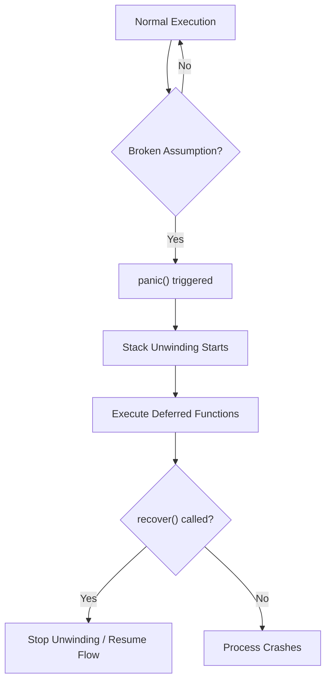

# FE.10 Panic and Recover

## Mission

Learn when panic is appropriate, when it is not, and how recover turns a crash into an explicit boundary decision.

## Prerequisites

- `FE.7` order summary
- `FE.9` closures mechanics (for understanding `defer` with anonymous functions)

## Mental Model

Think of **Panic** as the "Nuclear Option" for impossible system states.
- **Errors** are for expected failures (e.g., "File not found").
- **Panic** is for broken assumptions (e.g., "Configuration is corrupted", "Critical dependency missing").

**Recover** is the safety net that catches a falling program before it hits the ground (crashes). It belongs at **Boundaries** (like a request handler), not inside business logic.

## Visual Model



## Machine View

A `panic` event triggers a process called **Stack Unwinding**.
1. The CPU stops executing the current line of code.
2. The runtime starts popping stack frames one by one.
3. For each frame, any `defer`red functions are executed.
4. If a deferred function calls `recover()`, the unwinding stops, the panic value is returned, and normal execution resumes from the point after the defer.
5. If the stack unwinds all the way to `main` without a recovery, the OS terminates the process and prints a stack trace.

## Run Instructions

```bash
go run ./03-functions-errors/10-panic-and-recover
```

## Code Walkthrough

- **`panic()`**: Triggers the emergency stop. It takes an interface value (usually a string or error) to explain why the program failed.
- **`recover()`**: A built-in function that returns the panic value and stops the crash. It **MUST** be called inside a `defer`red function to be effective.
- **Resiliency**: Notice that `main` continues to run even after `accessDatabase` panics. This is how Go servers stay alive even when a specific request handler fails.

> [!TIP]
> You have completed the Functions and Errors section! You are now ready to move into data modeling and system design. In [Section 04: Type Design](../../04-types-design/README.md), you will learn how to group data together using **Structs**.

## Try It

1. Comment out the `defer` block in `accessDatabase` and run the program. Observe the process crash and the detailed stack trace provided by the Go runtime.
2. Add a second `accessDatabase(true)` call after the crisis operation in `main`. Observe how recovery allows the program to continue its work.
3. Change the panic value to a custom error type instead of a string and see how `recover()` captures it.

## In Production

In production Go code, you should almost never write `panic()`. Instead, you handle everything as an `error`.
However, you should almost always use `recover()` at your top-level entry points (like an HTTP middleware) to prevent a single buggy request from crashing your entire server for everyone else.

## Thinking Questions

1. Why does Go require `recover()` to be called inside a `defer`red function?
2. When is a panic more honest than returning a "silent" error?
3. What is the danger of recovering from every single panic without logging it?

## Next Step

Next: `TI.1` -> [`04-types-design/1-struct`](../../04-types-design/1-struct/README.md)
