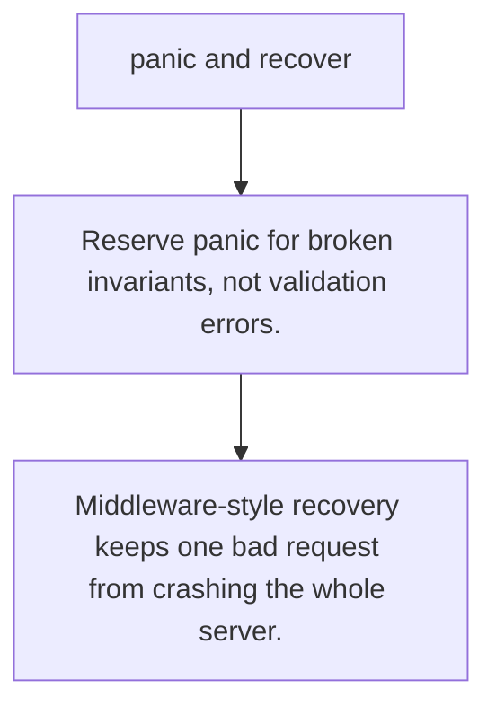

# FE.10 panic and recover

## Mission

Learn when panic is appropriate, when it is not, and how recover turns a crash into an explicit boundary decision.

## Prerequisites

- FE.9

## Mental Model

Errors describe expected failure. Panic describes broken assumptions. Recover belongs at process or request boundaries, not in ordinary business flow.

## Visual Model



## Machine View

A panic starts stack unwinding. Deferred functions run during that unwind, which is why recover only works inside a deferred call on the same goroutine.

## Run Instructions

```bash
go run ./03-functions-errors/10-panic-and-recover
```

## Code Walkthrough

### Reserve panic for broken invariants, not validation er

Reserve panic for broken invariants, not validation errors.

### Recover works only from a deferred function on the pan

Recover works only from a deferred function on the panicking goroutine.

### Middleware-style recovery keeps one bad request from c

Middleware-style recovery keeps one bad request from crashing the whole server.

## Try It

1. Change one of the example inputs and rerun the lesson.
2. Explain which boundary the lesson is trying to make explicit.
3. Describe how you would apply FE.10 in a small service or tool.

## ⚠️ In Production

Use panic sparingly for programmer bugs or impossible states, then recover only at boundaries where you can translate the crash into logging and containment.

## 🤔 Thinking Questions

1. What problem does this topic solve?
2. What breaks if this boundary is handled implicitly instead of explicitly?
3. Where would you expect to use this topic in production Go code?

## Next Step

Use this lesson as a reference surface before moving to the next track in the section.
