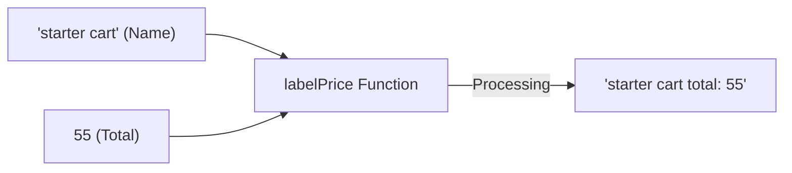

# FE.2 Parameters and Returns

## Mission

Learn how a function receives input and gives a result back to the caller.

## Prerequisites

- `FE.1` functions basics

## Mental Model

Functions are like **Data Processors**.
- **Parameters (Input)**: The raw materials the function needs to do its work.
- **Return Values (Output)**: The finished product it sends back to the caller.

Without parameters, a function is a static script. With parameters, it becomes a dynamic tool that can handle different data every time it's called.

> [!NOTE]
> In [FE.1 Functions Basics](../1-functions-basics/README.md), you created simple functions that took no inputs and returned nothing. Now you will learn how to pass data across that function boundary.

## Visual Model



## Machine View

1. **Stack Allocation**: When a function is called, space is allocated on the **Stack** for its parameters and local variables.
2. **Pass by Value**: Go is strictly "pass by value".
   - For `int` or `string`, a physical copy of the data is made.
   - For slices (`[]int`), the **Slice Header** (pointer, len, cap) is copied. This means the function can still modify the original backing array (as seen in [DS.5](../../02-language-basics/04-data-structures/5-slices-2/README.md)).
3. **The Return**: When the function hits `return`, the result is placed in a specific CPU register or stack location for the caller to pick up.

## Run Instructions

```bash
go run ./03-functions-errors/2-parameters-and-returns
```

## Code Walkthrough

- **`func sumPrices(prices []int) int`**: Accepts a slice and promises to return one integer.
- **`return total`**: The explicit command to send the result back.
- **`fmt.Sprintf(...)`**: Returns a new string by formatting the inputs.
- **`total := sumPrices(prices)`**: Captures the returned value into a variable in `main`.

> [!TIP]
> You just learned how to return a single value (`int` or `string`). But what if your function needs to return a result *and* an indication of success or failure? Go solves this by returning multiple values at once. You will learn this next in [FE.3 Multiple Return Values](../3-multiple-return-values/README.md).

## Try It

1. In `main.go`, add one more number to the `prices` slice and run the program.
2. Create a new function `func calculateTax(total int) int` that returns `total / 10`. Call it in `main` and print the result.
3. Try to use a variable declared inside `sumPrices` (like `total`) from within `main()`. What error does the compiler give?

## In Production

"Pure Functions"—functions that only rely on their inputs and don't modify global state—are the gold standard in software engineering. They are predictable, easy to test, and don't cause "spooky action at a distance" bugs.

## Thinking Questions

1. Why does Go require you to specify the **Type** of the parameters and return value?
2. What happens to the memory allocated for a function's local variables when the function returns?
3. In what scenario would you prefer a function that returns a value over one that just prints the result?

## Next Step

Next: `FE.3` -> [`03-functions-errors/3-multiple-return-values`](../3-multiple-return-values/README.md)
