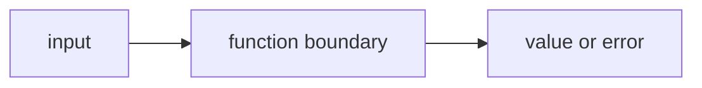

# FE.2 Parameters and Returns

## Mission

Learn how a function receives input and gives a result back to the caller.

## Why This Lesson Exists Now

Now you know how to name a piece of work. But functions are more useful when they can accept input and return output.

That is what parameters and return values do. They let you write flexible, reusable code that works with different data.

> **Backward Reference:** In [Lesson 1: Functions Basics](../1-functions-basics/README.md), you created simple functions that took no inputs and returned nothing. Now you will learn how to pass data across that function boundary.

## Prerequisites

- `FE.1` functions basics

## Mental Model

Parameters are the values a function needs to do its job.
Return values are the results it gives back.

## Visual Model


```text
prices ----------------------+
                             |
main() ---> sumPrices(prices)|
                             v
                         total = 55
```

```text
labelPrice("starter cart", 55)
          |              |
       input 1        input 2

returns:
"starter cart total: 55"
```

## Machine View

When a function is called, the caller passes values into the function parameters.

Important early machine truths:

- basic values like `int` are copied into the function parameter
- a slice parameter copies the slice header, not the whole backing array
- the function computes its result and returns a new value to the caller

So in this lesson:

- `labelPrice` receives copied input values
- `sumPrices` receives a copy of the slice header, then reads the same underlying slice data

## Run Instructions

```bash
go run ./03-functions-errors/2-parameters-and-returns
```

## Code Walkthrough

### `func announceCart(name string) {`

This function has one parameter: `name string`.

That means:

- the function expects one input
- the input is called `name`
- the input type is `string`

### `func sumPrices(prices []int) int {`

This line adds a second important idea:

- the function accepts a slice parameter
- the function promises to return one `int`

The return type appears after the parameter list.

### `total := 0`

This creates the running total inside the function body.
It exists only while `sumPrices` is running.

### `for _, price := range prices {`

This line loops through the slice parameter.
The function does not care where the slice came from.
It only cares that it received a slice named `prices`.

### `total += price`

This is the work of the function:
combine each price into the running total.

### `return total`

This line sends the final result back to the caller.
Without `return`, the caller would not receive the computed total.

### `func labelPrice(name string, total int) string {`

This function shows two parameters and one returned value.
It takes input, formats a sentence, and returns a new string.

### `announceCart("starter cart")`

This call passes a string argument into `announceCart`.

### `total := sumPrices(prices)`

This line is one of the main lesson lines.

- call `sumPrices`
- receive the returned `int`
- store that result in `total`

### `summary := labelPrice("starter cart", total)`

This line passes two values into a function and receives one string back.
That is the full parameter-and-return contract in one readable line.

## Try It

1. Add one more number to `prices` and run the lesson again.
2. Change the cart name from `"starter cart"` to another label.
3. Rename `total` in `main()` to `subtotal` and keep the program working.

## Common Questions

- Why is the return type after the parameters?
  That is Go's function signature style.

- Does passing a slice mean Go copies the whole slice data?
  No. It copies the slice header, which still points to the same underlying data.

## In Production
Most useful code is "input in, result out."
Clear parameters and return values are the first step toward dependable business logic.

## Thinking Questions
1. What problem is this lesson trying to solve?
2. What would change if you removed this idea from the program?
3. Where do you expect to see this pattern again in real Go code?

> **Forward Reference:** You just learned how to return a single value (`int` or `string`). But what if your function needs to return a result *and* an indication of success or failure? Go solves this uniquely by returning multiple values at once. You will learn this next in [Lesson 3: Multiple Return Values](../3-multiple-return-values/README.md).

## Next Step

Next: `FE.3` -> `03-functions-errors/3-multiple-return-values`

Open `03-functions-errors/3-multiple-return-values/README.md` to continue.
