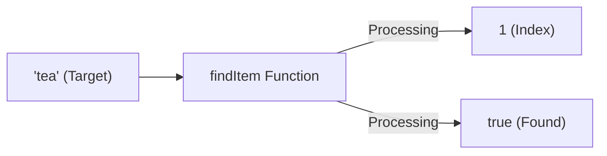

# FE.3 Multiple Return Values

## Mission

Learn how one function can return more than one value and why that matters before errors enter the picture.

## Prerequisites

- `FE.2` parameters and returns

## Mental Model

Sometimes one result is not enough. Imagine searching for a book in a library:
- **Case 1**: Found it! Here is the book (Value) and a confirmation (Success).
- **Case 2**: Not here. I can't give you the book (Zero Value), and here is a notice (Failure).

Go handles this naturally by allowing functions to return multiple variables at once. This avoids the "Ambiguous Zero" problem (where returning `0` could mean "item at index 0" or "not found").

> [!NOTE]
> In [FE.2 Parameters and Returns](../2-parameters-and-returns/README.md), you learned how to return a single computed result. Multiple return values simply extend that syntax, allowing functions to remain explicit and honest about all facets of an outcome.

## Visual Model



## Machine View

When a function returns multiple values, Go effectively places multiple items back on the stack or into multiple CPU registers.
- The caller **must** handle all returned values.
- If you only care about one of them, you can use the **Blank Identifier** (`_`) to ignore the others: `index, _ := findItem(items, "tea")`.

## Run Instructions

```bash
go run ./03-functions-errors/3-multiple-return-values
```

## Code Walkthrough

- **`(int, bool)`**: The return signature is now wrapped in parentheses to indicate multiple types.
- **`return i, true`**: Returning two values separated by a comma.
- **`index, found := findItem(...)`**: Destructuring the results into two local variables in the caller.
- **`strings.SplitN(...)`**: A built-in example of a function that helps split data into multiple parts.

> [!TIP]
> You now know how to return two values. The most common use case for this in Go is returning a result *and* an error object. In [FE.4 Errors As Values](../4-errors-as-values/README.md), you will learn how Go handles failures without using exceptions.

## Try It

1. In `main.go`, change the target from `"tea"` to `"coffee"` (which isn't in the list). Observe the output.
2. In `splitName`, try passing a name without a space (e.g., `"Prince"`). What does the function return?
3. Create a function `func minMax(nums []int) (int, int)` that returns both the smallest and largest numbers in a slice.

## In Production

Go's explicit multiple returns are what make it feel "honest". You rarely have to guess if a function succeeded or failed by looking for sentinel values like `-1` or `null`. The success/error is always right there next to the data.

## Thinking Questions

1. Why is `index, found := findItem(...)` safer than just returning `-1` for a missing item?
2. What happens if you try to call a function that returns two values but only assign it to one variable?
3. When should you use a single return value versus multiple return values?

## Next Step

Next: `FE.4` -> [`03-functions-errors/4-errors-as-values`](../4-errors-as-values/README.md)
