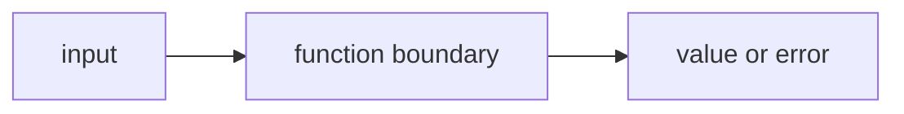

# FE.3 Multiple Return Values

## Mission

Learn how one function can return more than one value and why that matters before errors enter the picture.

## Why This Lesson Exists Now

You now know how to pass data into functions and get a result back. But sometimes you need more than one piece of information.

For example, a function that searches a list might need to return both the result AND whether it was found. Go handles this naturally by allowing multiple return values.

This lesson builds on FE.2 by showing how to return more than one piece of data.

## Prerequisites

- `FE.2` parameters and returns

## Mental Model

Sometimes one result is not enough.
A function may need to return:

- a value and a success signal
- two related values
- a result and some extra context

## Visual Model


```text
findItem(items, "tea")
        |
        +--> returns (1, true)
```

```text
splitName("Ava Stone")
        |
        +--> returns ("Ava", "Stone")
```

```text
caller chooses what each returned value means
```

## Machine View

Go lets a function hand multiple values back to the caller directly.

The important machine truth here is not “where each byte goes.”
It is that the caller receives more than one result and must decide what to do with each one.

That prepares the learner for the next lesson, where the second value becomes an `error`.

## Run Instructions

```bash
go run ./03-functions-errors/3-multiple-return-values
```

## Code Walkthrough

### `func findItem(items []string, target string) (int, bool) {`

This function returns two values:

- an `int` index
- a `bool` that says whether the search succeeded

This is the most important line in the lesson because it changes the learner's idea of what a
function result can be.

### `for i, item := range items {`

The function loops through the slice one item at a time.

### `if item == target {`

This checks whether the current item matches what the caller wants.

### `return i, true`

This line returns immediately with:

- the matching index
- a success signal

### `return -1, false`

This is the fallback path.
The function still returns two values, but they now mean:

- no usable index
- search failed

### `func splitName(fullName string) (string, string) {`

This second function returns two related values without using a boolean.

That proves multiple return values are broader than only “success or failure.”

### `parts := strings.SplitN(fullName, " ", 2)`

This splits the full name into at most two pieces.
The lesson keeps the string handling simple so the main topic stays on return shape.

### `if len(parts) < 2 {`

This guard keeps the function honest when the input does not contain a space.

### `return fullName, ""`

If the input has only one visible part, the function still returns two values:

- the original input as the first name slot
- an empty string as the second slot

### `return parts[0], parts[1]`

If the split succeeded, the function returns the first and last name directly.

### `index, found := findItem(items, "tea")`

This line is the caller-side version of the lesson.
It receives two values and gives both of them names.

### `firstName, lastName := splitName("Ava Stone")`

This line shows the same pattern again with a different meaning.

## Try It

1. Search for a different item in `findItem`.
2. Change `"Ava Stone"` to another two-part name.
3. Change the missing return from `-1` to another sentinel value and explain why `found` still matters.

## Common Questions

- Why not return only the index from `findItem`?
  Because `0` could be a real index. The second value makes success explicit.

- Is this already the same as `(value, error)`?
  Not yet, but it prepares you for that pattern.

## ⚠️ In Production
Multiple return values let Go functions communicate more honestly.
They make success, failure, and extra context visible to the caller.

## 🤔 Thinking Questions

1. What problem is this lesson trying to solve?
2. What would change if you removed this idea from the program?
3. Where do you expect to see this pattern again in real Go code?
## Next Step

Continue to `FE.4` errors as values.
