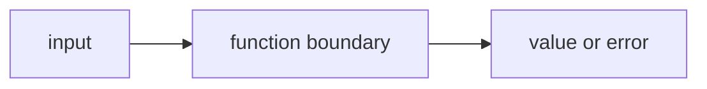

# FE.4 Errors as Values

## Mission

Learn the core Go rule for ordinary failure: return an error value instead of hiding the failure.

## Why This Lesson Exists Now

You can now return multiple values from functions. But what happens when something goes wrong?

In Go, errors are just values. You return an error alongside your normal result, and the caller decides what to do. This is different from exceptions in other languages.

> **Backward Reference:** In [Lesson 3: Multiple Return Values](../3-multiple-return-values/README.md), you learned how to return more than one result from a single function. Returning an error is simply the most common and important application of that feature.

## Prerequisites

- `FE.3` multiple return values

## Mental Model

In Go, an error is a value returned to the caller.

That means:

- the function does not hide failure
- the caller sees the failure directly
- the caller decides what to do next

## Visual Model


```text
divide(12, 3)
    |
    +--> returns (4, nil)
```

```text
divide(12, 0)
    |
    +--> returns (0, error)
```

```text
caller:
result, err := divide(...)
if err != nil {
    handle it
}
```

## Machine View

An `error` is not magic control flow.
It is just another returned value.

The important machine truth is:

- the function returns normally
- one returned slot holds the main result
- one returned slot holds either `nil` or an error value
- the caller must inspect that second value before trusting the result

This is why Go error handling stays visible in the code.

## Run Instructions

```bash
go run ./03-functions-errors/4-errors-as-values
```

## Code Walkthrough

### `func divide(total int, parts int) (int, error) {`

This signature says the function returns:

- one `int` result
- one `error`

That is the foundations version of Go's most important contract pattern.

### `if parts == 0 {`

This is the failure guard.
The function checks the bad input before attempting the operation.

### `return 0, errors.New("cannot divide by zero")`

This line is the heart of the lesson.

It returns:

- a placeholder result
- a non-`nil` error value that explains the failure

### `return total / parts, nil`

This is the success path.

- the integer result is meaningful
- the error is `nil`

### `func lookupPrice(catalog map[string]int, item string) (int, error) {`

This second function proves the same contract pattern in a different setting.
Errors are not only for math problems.

### `price, exists := catalog[item]`

This line uses the map comma-ok pattern from the previous section.

### `return 0, fmt.Errorf("price not found for %q", item)`

This returns a formatted error when the requested item is missing.

### `result, err := divide(12, 0)`

This is the caller-side pattern.
The caller receives both values and keeps them separate.

### `if err != nil {`

This is the discipline the learner needs to build now:
check the error before trusting the result.

### `teaPrice, err := lookupPrice(catalog, "tea")`

This repeats the same pattern in a data-lookup example so the idea does not stay stuck to only one
toy function.

## Try It

1. Change `divide(12, 0)` to `divide(12, 4)` and watch the success path.
2. Ask for a missing catalog item like `"milk"` and observe the returned error.
3. Add one more item to the catalog and look it up successfully.

## Common Questions

- Why return `0` on failure?
  Because the real signal is the non-`nil` error. The caller must not trust the result when `err`
  is non-`nil`.

- Why not use panic here?
  Because ordinary failure should stay in the normal return path.

## ⚠️ In Production
Go services rely on visible error handling.
Returning errors as values keeps the success path and failure path readable.

## 🤔 Thinking Questions

1. What problem is this lesson trying to solve?
2. What would change if you removed this idea from the program?
3. Where do you expect to see this pattern again in real Go code?

> **Forward Reference:** Now you know how to return errors when an operation fails. But how do you prevent bad data from causing operations to fail in the first place? In [Lesson 5: Validation](../5-validation/README.md), you will learn how to check inputs at the function boundary before performing expensive or dangerous work.

## Next Step

Continue to `FE.5` validation.
