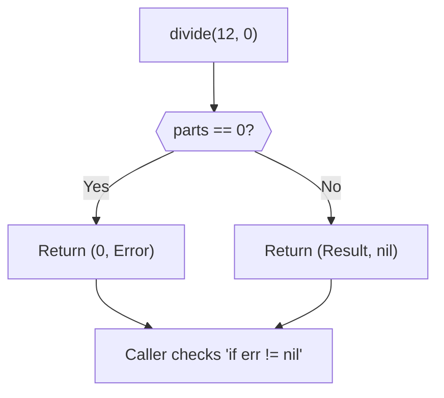

# FE.4 Errors as Values

## Mission

Learn the core Go rule for ordinary failure: return an error value instead of hiding the failure behind exceptions.

## Prerequisites

- `FE.3` multiple return values

## Mental Model

In Go, **Errors are Values**.
They are not special signals that "blow up" your program. They are just another piece of data returned by a function.
- If the function succeeded: `(result, nil)`
- If the function failed: `(zero-value, error)`

The caller is responsible for checking the second value (`err`) before doing anything with the first value (`result`).

> [!NOTE]
> In [FE.3 Multiple Return Values](../3-multiple-return-values/README.md), you learned how to return more than one result. Returning an error is simply the most common and important application of that feature in Go.

## Visual Model



## Machine View

An `error` is actually an **Interface** (which you'll learn about in Section 04), but at the machine level:
- It's a pointer to a struct containing an error message string.
- If the pointer is `nil`, the CPU sees a zero memory address, which Go interprets as "no error".
- Checking `if err != nil` is a very fast CPU comparison against zero.

## Run Instructions

```bash
go run ./03-functions-errors/4-errors-as-values
```

## Code Walkthrough

- **`errors.New("msg")`**: Creates a basic error value with a fixed message.
- **`fmt.Errorf("msg %v", val)`**: Creates a dynamic error value with formatted data.
- **`nil`**: The universal "no error" signal.
- **`if err != nil`**: The most famous line in Go code. It means "if there is an error, handle it now."

> [!TIP]
> Now you know how to return errors when an operation fails. But how do you prevent bad data from causing operations to fail in the first place? In [FE.5 Validation](../5-validation/README.md), you will learn how to check inputs at the function boundary before performing expensive or dangerous work.

## Try It

1. In `main.go`, change `divide(12, 0)` to `divide(12, 4)`. Does the `if err != nil` block still run?
2. Add a new item to the `catalog` map and look it up successfully.
3. Try to look up an item that is **not** in the catalog. Observe the formatted error message.

## In Production

Go's error handling might feel repetitive (writing `if err != nil` everywhere), but it ensures that every possible failure point is explicitly considered by the engineer. This is why Go systems are known for being highly reliable under heavy load—failures are managed, not ignored.

## Thinking Questions

1. Why does Go prefer returning an error over throwing an exception?
2. Why should you **not** trust the `result` value if `err` is not `nil`?
3. What is the difference between `errors.New` and `fmt.Errorf`?

## Next Step

Next: `FE.5` -> [`03-functions-errors/5-validation`](../5-validation/README.md)
