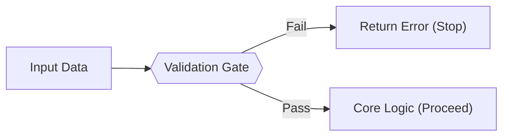

# FE.5 Validation

## Mission

Learn how a function rejects bad input before the program does the real work using "Guard Clauses".

## Prerequisites

- `FE.4` errors as values

## Mental Model

Validation is the **Security Guard** at the entrance of your function.
If the data looks suspicious (empty strings, negative prices, etc.), the guard stops the execution immediately and sends back an error.

By rejecting bad data early, you keep the "Happy Path" (the core logic of your function) clean and safe from edge-case bugs.

> [!NOTE]
> In [FE.4 Errors as Values](../4-errors-as-values/README.md), you learned the mechanics of returning an error. Validation is one of the most common applications of this pattern: inspecting input and returning an error if it fails the rules.

## Visual Model



## Machine View

The "Guard Clause" pattern optimizes for the success path while minimizing nesting.
- Instead of using `else` blocks, we `return` early on failure.
- This keeps the function's memory usage low (fewer stack frames for nested logic).
- It makes the code easier for the CPU branch predictor to handle because the failure paths are short-circuited.

## Run Instructions

```bash
go run ./03-functions-errors/5-validation
```

## Code Walkthrough

- **`validateCartName`**: Checks if the string is empty or just whitespace.
- **`strings.TrimSpace(name)`**: Ensures "   " is treated as empty.
- **`validatePrices`**: Checks if the slice is empty AND if any individual price is negative.
- **Return early**: The moment a negative price is found, the function exits. It doesn't keep checking the rest of the slice.

> [!TIP]
> You now have the tools to validate data and return errors. But what happens when you have a complex process that requires multiple validation steps, a computation, and formatting a final result? In [FE.6 Orchestration](../6-orchestration/README.md), you will learn how to coordinate multiple smaller functions from one central "orchestrator" function.

## Try It

1. In `main.go`, try validating a cart name with only symbols (e.g., `"$#%"`). Does it pass current validation?
2. Add a new rule to `validatePrices`: no price should be greater than `1000`.
3. Try passing a `nil` slice to `validatePrices`. What happens to the `len(prices)` check?

## In Production

Validation is not just about catching errors—it's about defining the **Contract** of your function. When you validate inputs, you are telling other developers (and your future self) exactly what kind of data your logic is designed to handle.

## Thinking Questions

1. Why is it better to return an error than to silently fix the bad data (like changing a negative price to 0)?
2. How does the "Return Early" pattern make code easier to read compared to nested `if/else` blocks?
3. What is the difference between a validation error and a program crash (panic)?

## Next Step

Next: `FE.6` -> [`03-functions-errors/6-orchestration`](../6-orchestration/README.md)
