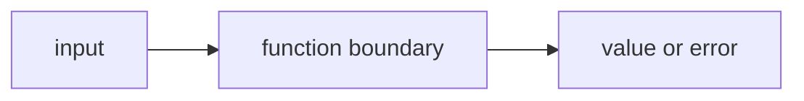

# FE.5 Validation

## Mission

Learn how a function rejects bad input before the program does the real work.

## Why This Lesson Exists Now

Now you know how to return errors. The next question is: when should you return one?

The answer: when input is clearly wrong. This is called validation. It catches problems early before they cause harder-to-debug issues later.

This lesson builds on FE.4 by showing how to check inputs explicitly.

## Prerequisites

- `FE.4` errors as values

## Mental Model

Validation is the first gate before useful work begins.

If the input is clearly wrong, the function should say so immediately instead of pretending the work
can continue safely.

## Visual Model



```text
cart name -----------+
prices --------------+--> validation gate --> ok --> continue
```

```text
cart name -----------+
prices --------------+--> validation gate --> error --> stop early
```

## Machine View

Validation changes control flow very early.

The important machine truth is:

- the function reads the input
- it checks the input against a rule
- if the rule fails, the function returns immediately with an error value
- later lines in that function do not run on the failure path

That "return early" behavior is the real engineering habit this lesson is building.

## Run Instructions

```bash
go run ./03-functions-errors/5-validation
```

## Code Walkthrough

### `func validateCartName(name string) error {`

This function takes one input and returns one `error`.

That alone teaches a useful shape:

- some functions do not return business data
- some functions return only "did this pass or fail?"

### `strings.TrimSpace(name) == ""`

This line treats blank spaces as empty input too.
That makes the validation rule more honest than checking only `name == ""`.

### `return errors.New("cart name is required")`

This is the failure path.
The function does not continue because the input is not valid enough.

### `return nil`

This is the success path.
`nil` means "no validation error."

### `func validatePrices(prices []int) error {`

This second validator shows that one section can have several input checks, each with one clear job.

### `if len(prices) == 0 {`

This rejects an empty slice before any loop begins.

### `for i, price := range prices {`

This line checks each input value one by one.

### `if price < 0 {`

This is the specific rule for "bad price data."

### `return fmt.Errorf("price at index %d cannot be negative", i)`

This builds an error that tells the caller exactly which input failed.

### `err := validateCartName("starter cart")`

This shows the caller-side pattern again:

- call the validator
- receive the error
- inspect the error before moving on

## Try It

1. Change the first cart name to an empty string and watch the failure path.
2. Change one of the prices to a negative number and observe the returned error.
3. Replace `"starter cart"` with `"   "` and confirm that whitespace-only input still fails.

## Common Questions

- Why validate before the real work starts?
  Because bad input should stop the flow before it can create a misleading result.

- Why return `error` instead of `bool`?
  Because the caller needs a reason, not only a yes/no signal.

## In Production

Validation is one of the earliest places where engineering discipline shows up.
It protects the rest of the program from clearly broken input.

## Thinking Questions

1. What problem is this lesson trying to solve?
2. What would change if you removed this idea from the program?
3. Where do you expect to see this pattern again in real Go code?

## Next Step

Continue to `FE.6` orchestration.
