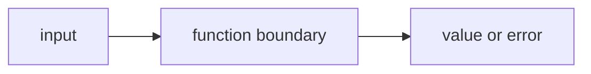

# FE.6 Orchestration

## Mission

Learn how one function can coordinate several smaller helpers without losing readability.

## Why This Lesson Exists Now

You now know how to write individual functions that do one job well. But how do you combine them into a larger workflow?

That is orchestration: one function that calls several helpers in the right order. It keeps the main function clean while still doing complex work.

> **Backward Reference:** In [Lesson 5: Validation](../5-validation/README.md), you learned how to write early guard clauses. Here, you will use those validators as the first steps in a larger orchestration function, guaranteeing that bad data never reaches the core logic.

## Prerequisites

- `FE.5` validation

## Mental Model

Orchestration means one function controls the order of several smaller jobs.

It does not do every detail itself.
It decides:

- what should happen first
- what should happen next
- when the whole flow should stop early

## Visual Model



```text
processCart(name, prices)
   |
   +--> validateCartName(name)
   |
   +--> validatePrices(prices)
   |
   +--> sumPrices(prices)
   |
   +--> buildSummary(name, total)
   |
   +--> return summary
```

```text
if any validation step returns an error
processCart stops immediately
and returns that error to the caller
```

## Machine View

Orchestration is mostly about control flow between functions.

The important machine truth is:

- the caller enters one top-level function
- that function calls helpers one at a time
- each helper returns control to the orchestrator
- the orchestrator decides whether to continue or return early

This is how programs start growing without becoming one giant `main()`.

## Run Instructions

```bash
go run ./03-functions-errors/6-orchestration
```

## Code Walkthrough

### `func processCart(name string, prices []int) (string, error) {`

This is the orchestration function.
It does not own every small detail.
It owns the order of the work.

### `if err := validateCartName(name); err != nil {`

This line says:

- run the validation helper
- if it failed, stop immediately
- return the error to the caller

That is the cleanest early example of short-circuit control flow across functions.

### `if err := validatePrices(prices); err != nil {`

This repeats the same pattern for the second validation rule.

The repetition is useful because it teaches a readable contract:

- validate
- stop if invalid
- continue only if safe

### `total := sumPrices(prices)`

Only after validation succeeds does the orchestrator continue to the real work.

### `summary := buildSummary(name, total)`

This delegates the formatting step to another helper instead of mixing it into the control logic.

### `return summary, nil`

This returns a successful result only after every earlier step passed.

### `summary, err := processCart("starter cart", []int{12, 18, 25})`

This is the caller-side pattern:

- one function call
- one summary result
- one error result

The caller does not need to know every internal helper step.

## Try It

1. Change the cart name to an empty string and watch the early return path.
2. Add a negative price and confirm that `sumPrices` is no longer reached.
3. Add one more price and see how the summary changes on the success path.

## Common Questions

- Why not call `sumPrices` directly from `main()`?
  Because `processCart` is teaching how one function can own the whole flow.

- Is orchestration the same as abstraction?
  Not exactly. This lesson is about ordering helper steps clearly.

## ⚠️ In Production

Real application code often becomes readable because one function coordinates smaller helpers
instead of doing everything in one place.

## 🤔 Thinking Questions

1. What problem is this lesson trying to solve?
2. What would change if you removed this idea from the program?
3. Where do you expect to see this pattern again in real Go code?

> **Forward Reference:** Up to this point, all your functions have been rigidly defined at compile time. In [Lesson 8: First-Class Functions](../8-first-class-functions/README.md), you will discover that functions themselves can be treated as data—assigned to variables and passed as arguments.

## Next Step

Continue to `FE.8` first-class functions.
