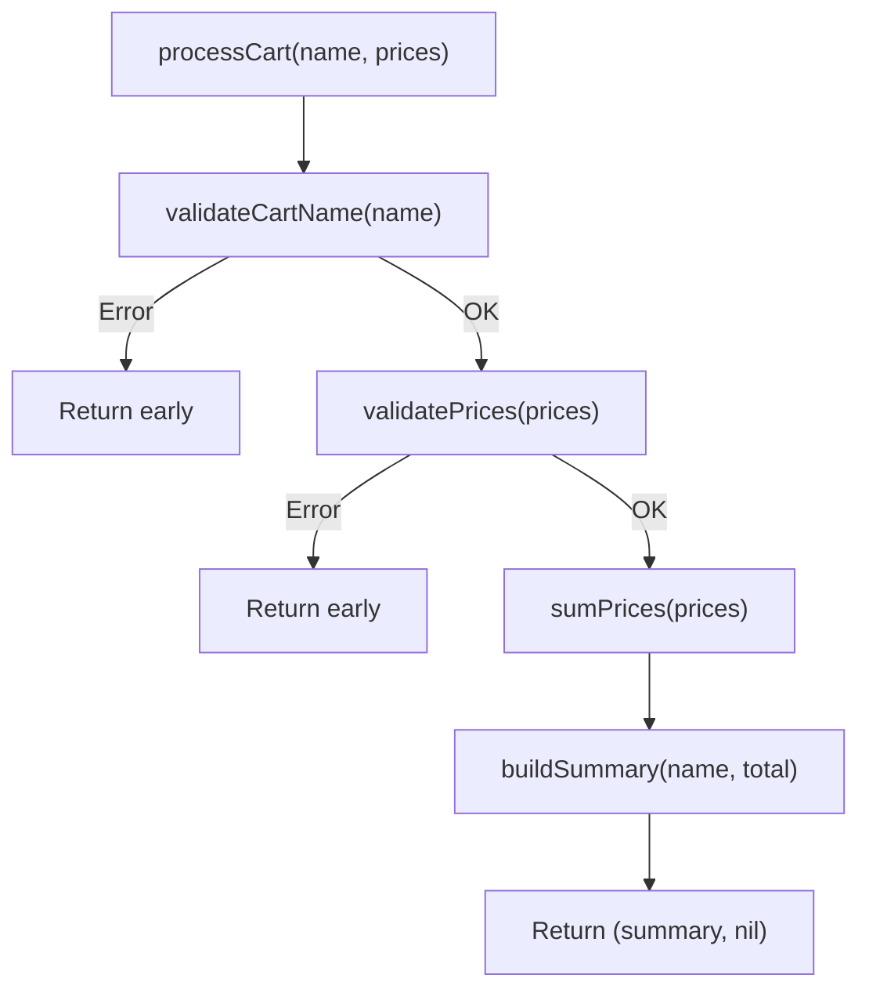

# FE.6 Orchestration

## Mission

Learn how one function can coordinate several smaller "Specialist" functions to build a complex workflow.

## Prerequisites

- `FE.5` validation

## Mental Model

Orchestration is like being a **Project Manager**.
A Project Manager doesn't do the design, writing, or coding themselves. Instead, they:
1. Define the order of operations.
2. Call the right specialists at the right time.
3. Stop the project if a critical step fails.

This keeps your code "modular". If the validation logic needs to change, you only change the validator function—the orchestrator stays the same.

> [!NOTE]
> In [FE.5 Validation](../5-validation/README.md), you learned how to write early guard clauses. Here, you will use those validators as the first steps in a larger orchestration function, guaranteeing that bad data never reaches the core logic.

## Visual Model



## Machine View

Orchestration is about managing the **Call Stack**.
1. `main` calls `processCart`.
2. `processCart` calls `validateCartName`.
3. Control returns to `processCart`.
4. `processCart` checks the error.
5. If clean, `processCart` calls the next helper.
This creates a "layered" execution where the orchestrator maintains the state (like the `total` variable) while helpers do the math or formatting.

## Run Instructions

```bash
go run ./03-functions-errors/6-orchestration
```

## Code Walkthrough

- **`processCart`**: The Orchestrator. It coordinates the helpers.
- **Short-Circuiting**: If any validator returns a non-nil `err`, `processCart` immediately returns that error to `main`.
- **Delegation**: `processCart` doesn't know *how* to sum prices or format a string; it just knows which functions to call to get those results.

> [!TIP]
> You have now learned how to validate data, handle errors, and orchestrate complex flows. It's time to put all of these skills to the test. In [FE.7 Order Summary](../9-order-summary/README.md), you will build a complete pricing and tax engine from scratch.

## Try It

1. In `main.go`, add a new helper function `func calculateTax(total int) int` and add it to the `processCart` flow.
2. Modify the summary to include the tax amount.
3. What happens if you call `sumPrices` *before* `validatePrices`? Why is the order important?

## In Production

Real-world Go services (like an API endpoint) are almost entirely orchestration.
`HandleRequest` -> `ValidateInput` -> `CheckAuth` -> `QueryDatabase` -> `FormatResponse`.
Keeping these steps separated into helpers is what allows teams to maintain massive codebases for years.

## Thinking Questions

1. Why does `processCart` return `(string, error)` instead of just `string`?
2. How does orchestration help you write unit tests for your code?
3. What is the danger of an orchestrator that "knows too much" about the inner workings of its helpers?

## Next Step

Next: `FE.8` -> [`03-functions-errors/7-first-class-functions`](../7-first-class-functions/README.md)
