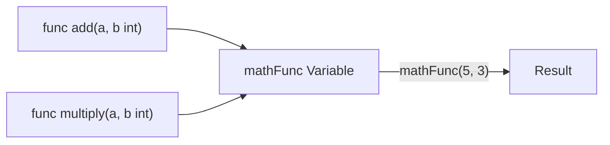

# FE.8 First-Class Functions

## Mission

Learn that functions are ordinary values in Go, which makes callbacks and higher-order helpers possible.

## Prerequisites

- `FE.6` orchestration

## Mental Model

In Go, **Functions are First-Class Citizens**.
This means they are treated like any other value (like an `int` or a `string`).
- You can store a function in a **Variable**.
- You can pass a function as an **Argument** to another function.
- You can **Return** a function from a function.

This unlocks "Higher-Order" programming, where you can pass *behavior* into a function instead of just data.

> [!NOTE]
> In [FE.6 Orchestration](../6-orchestration/README.md), you hardcoded the exact helpers that `processCart` called. First-class functions let you pass the behavior *into* the function dynamically, rather than hardcoding it.

## Visual Model



## Machine View

A function value is essentially a **Pointer** to the compiled instructions in the memory's text segment.
- When you assign `mathFunc = add`, you are copying the address of the `add` instructions into the `mathFunc` variable.
- Calling `mathFunc(5, 3)` tells the CPU to jump to that address, execute the logic, and return.
- This is extremely efficient because we are only passing a 64-bit address, not the logic itself.

## Run Instructions

```bash
go run ./03-functions-errors/7-first-class-functions
```

## Code Walkthrough

- **Function Type**: `func(int, int) int` is a type that matches any function with two integer parameters and one integer return.
- **Assignment**: `mathFunc = add` (no parentheses!) assigns the behavior.
- **Anonymous Functions**: `func(a, b int) int { ... }` defines a function without a name, which can be used immediately or assigned to a variable.
- **Callbacks**: Passing a function as an argument (`multiply` into `calculate`) allows `calculate` to remain generic while the caller provides the specific math logic.

> [!TIP]
> You now know how to assign anonymous functions to variables. But what happens if that anonymous function references variables from the surrounding code? In [FE.9 Closures Mechanics](../8-closures-mechanics/README.md), you will learn how functions can capture and remember state.

## Try It

1. In `main.go`, create a `divide` function and assign it to `mathFunc`, then call it.
2. Pass your new `divide` function into `calculate`.
3. Try defining a new anonymous function directly inside the `calculate()` call as the third argument.

## In Production

First-class functions are everywhere in Go production code:
- **Middleware**: Passing "next" handlers in HTTP services.
- **Sorting**: Passing a "Less" function to determine sort order.
- **Concurrency**: Passing a function to a goroutine to be executed in the background.

## Thinking Questions

1. Why does Go require the function signature of the variable to match the assigned function exactly?
2. What is the benefit of passing a function as a callback instead of using a large `switch` statement?
3. How does treating functions as values help in writing generic, reusable libraries?

## Next Step

Next: `FE.9` -> [`03-functions-errors/8-closures-mechanics`](../8-closures-mechanics/README.md)
