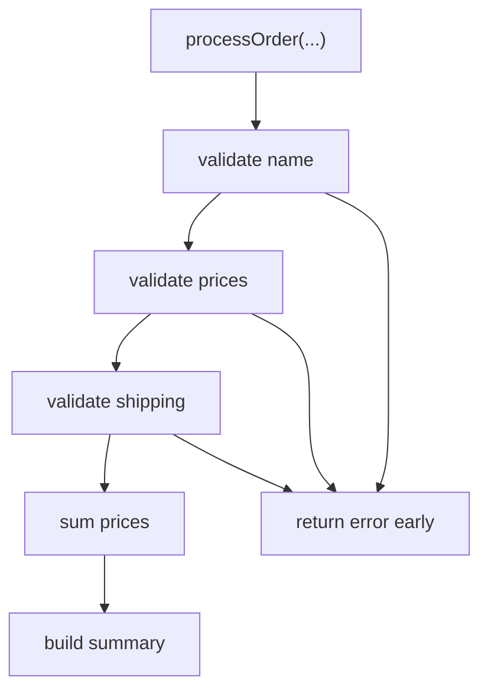

# FE.7 Order Summary

## Mission

Build a small order-summary program that combines validation, helper functions, multiple return values, and explicit errors into one readable flow.

## Prerequisites

- `FE.1` functions basics
- `FE.2` parameters and returns
- `FE.3` multiple return values
- `FE.4` errors as values
- `FE.5` validation
- `FE.6` orchestration

## Mental Model

This milestone is a pipeline of small functions:

- validate inputs
- stop early on error
- calculate totals
- build the final summary

The goal is not cleverness. It is honest flow control with clear responsibilities.

## Visual Model



## Machine View

Each helper returns control to `processOrder`. If a helper returns an error, `processOrder` immediately returns that error to its caller. Only the success path reaches the calculation and summary steps.

## Run Instructions

```bash
go run ./03-functions-errors/7-order-summary
go run ./03-functions-errors/7-order-summary/_starter
go test ./03-functions-errors/7-order-summary
```

## Solution Walkthrough

### Validation helpers

`validateOrderName`, `validatePrices`, and `validateShipping` each check one focused rule and return an error when the input is invalid.

### `sumPrices(prices []int) int`

This helper performs one job only: calculate the subtotal.

### `buildSummary(...)`

Formatting lives in its own helper so it does not get mixed into validation logic.

### `processOrder(...) (string, error)`

This function orchestrates the whole flow and makes the contract explicit: summary on success, error on failure.

### `return "", err`

Early returns keep failure handling honest and stop the flow before invalid data can produce misleading output.

## Try It

1. Add another item price to the success case.
2. Make shipping negative and trace the failure path.
3. Replace the order name with only spaces and verify validation stops the flow.

## Verification Surface

```bash
go run ./03-functions-errors/7-order-summary
go run ./03-functions-errors/7-order-summary/_starter
go test ./03-functions-errors/7-order-summary
```

## ⚠️ In Production

This is the everyday shape of backend Go code: validate, return errors explicitly, keep helpers small, and make orchestration readable. Systems become fragile when these concerns collapse into one giant function.

## 🤔 Thinking Questions

1. Why is returning an explicit error better than hiding failure inside printed output?
2. What gets clearer when validation, calculation, and formatting are separate helpers?
3. Why is `processOrder` a better owner of sequence than `main()`?

## Next Step

Continue to `TI.1` structs.
