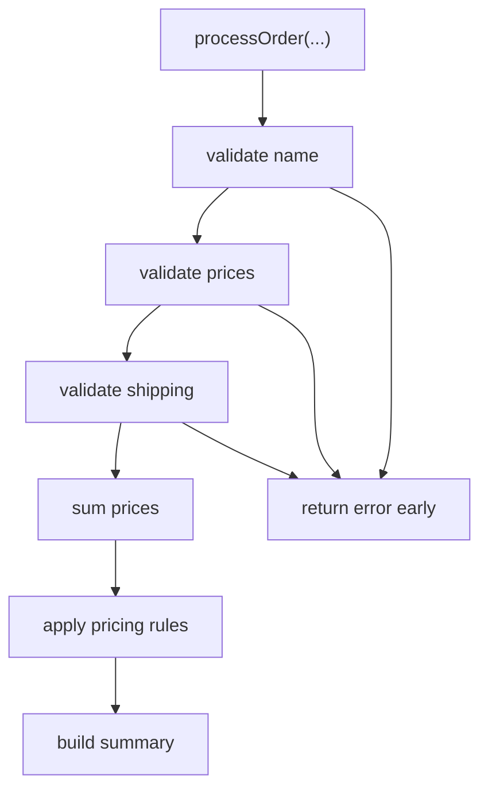

# FE.7 Order Summary

## Mission

Build a small order-summary program that combines validation, helper functions, first-class functions, closures, multiple return values, and explicit errors into one readable flow.

## Prerequisites

- `FE.1` functions basics
- `FE.2` parameters and returns
- `FE.3` multiple return values
- `FE.4` errors as values
- `FE.5` validation
- `FE.6` orchestration
- `FE.8` first-class functions
- `FE.9` closures - mechanics

## Mental Model

This milestone is a pipeline of small functions:

- validate inputs
- stop early on error
- calculate totals
- apply pricing rules passed in as callbacks
- build the final summary

The goal is not cleverness. It is honest flow control with clear responsibilities.

## Visual Model



## Machine View

Each helper returns control to `processOrder`. Pricing rules are passed in as function values, and the closure-built discount rule keeps its own threshold and amount alive after the factory function returns. If any validator fails, `processOrder` returns early before the pricing pipeline runs.

## Run Instructions

```bash
go run ./03-functions-errors/7-order-summary
go run ./03-functions-errors/7-order-summary/_starter
go test ./03-functions-errors/7-order-summary
```

## Solution Walkthrough

### Validation helpers

`validateOrderName`, `validatePrices`, and `validateShipping` each check one focused rule and return an error when the input is invalid.

### `sumPrices(prices []int) int`

This helper performs one job only: calculate the subtotal.

### `applyPricingRules(subtotal int, rules ...pricingRule) int`

This helper shows FE.8 directly: callers pass behavior in as function values, and the order flow applies them without knowing their internals.

### `makeMinimumSubtotalDiscount(...)`

This helper shows FE.9 directly: it returns a closure that captures the discount threshold and amount so the rule can be reused later.

### `buildSummary(...)`

Formatting lives in its own helper so it does not get mixed into validation logic, and it makes the rule-adjusted subtotal visible.

### `processOrder(...) (string, error)`

This function orchestrates the whole flow and makes the contract explicit: summary on success, error on failure. It also shows that orchestration can accept behavior from FE.8 without losing readability.

### `return "", err`

Early returns keep failure handling honest and stop the flow before invalid data can produce misleading output.

## Try It

1. Add another item price to the success case.
2. Change the discount threshold so the closure no longer applies to the starter order.
3. Add a second pricing rule and trace how the adjusted subtotal changes step by step.

## Verification Surface

```bash
go run ./03-functions-errors/7-order-summary
go run ./03-functions-errors/7-order-summary/_starter
go test ./03-functions-errors/7-order-summary
```

## ⚠️ In Production

This is the everyday shape of backend Go code: validate, return errors explicitly, keep helpers small, and pass policy in as narrow callbacks. Closure-based configuration is common in pricing, retries, middleware, and feature-flag evaluation.

## 🤔 Thinking Questions

1. Why is returning an explicit error better than hiding failure inside printed output?
2. What gets clearer when pricing policy is passed in as a function instead of hard-coded into `processOrder`?
3. Why is a closure a better fit for discount configuration than global variables?

## Next Step

Continue to `FE.10`.
