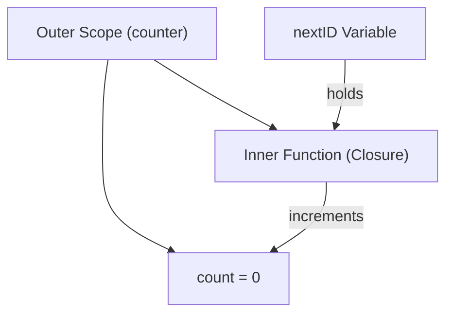

# FE.9 Closures Mechanics

## Mission

Learn how closures capture variables, why that extends lifetimes, and how to use them for stateful behavior.

## Prerequisites

- `FE.8` first-class functions

## Mental Model

A **Closure** is a function value that "closes over" and remembers variables from the scope where it was created.
- It doesn't just store the *value* of the variable at that moment.
- It holds a **Reference** to the variable itself.
- If the outer variable changes, the closure sees the updated value.

## Visual Model



## Machine View

Normally, local variables are stored on the **Stack** and are destroyed when the function returns.
- If a closure references an outer local variable, the Go compiler performs **Escape Analysis**.
- It detects that the variable must outlive the function call.
- The compiler then moves (escapes) that variable to the **Heap**.
- The closure carries a hidden pointer to that heap location, keeping the data alive as long as the closure exists.

## Run Instructions

```bash
go run ./03-functions-errors/8-closures-mechanics
```

## Code Walkthrough

- **`counter()`**: A factory function that returns a closure. Each call to `counter()` creates a unique, isolated `count` variable on the heap.
- **State Persistence**: `nextID()` increments the same `count` every time it is called, because it "remembers" that specific memory location.
- **Variable Capture**: `sayHello` captures the `message` string. If `message` is reassigned in the outer scope, `sayHello` prints the new value.
- **Loop Capture**: Demonstrates how to safely capture loop indices by rebinding them to a local block variable (`val := i`), which prevents all closures from sharing the final index value (a common pre-Go 1.22 bug).

> [!TIP]
> You have now learned the most advanced mechanics of Go functions. It's time to apply them in a real-world scenario. In [FE.7 Order Summary](../9-order-summary/README.md), you will use closures to create dynamic, configurable pricing rules.

## Try It

1. In `main.go`, create a second `anotherCounter := counter()`. Call it and `nextID()` alternately. Observe how they maintain separate state.
2. Add a `multiplier(factor int)` function that returns a closure. The closure should take an `int` and return it multiplied by the captured `factor`.
3. Try removing the `val := i` line in the loop and capture `i` directly. Does Go 1.22+ handle this automatically? (Hint: check your `go.mod` version).

## In Production

Closures are the standard way to:
- **Configure Middleware**: Capture API keys or DB connections to be used in every request.
- **Implement Iterators**: Maintain current position in a collection.
- **Functional Options**: Pass configurable behavior to constructors.

## Thinking Questions

1. Why does moving a variable to the heap have a performance cost compared to the stack?
2. What would happen if closures captured values instead of references?
3. How can closures lead to memory leaks if not handled carefully?

## Next Step

Next: `FE.7` -> [`03-functions-errors/9-order-summary`](../9-order-summary/README.md)
