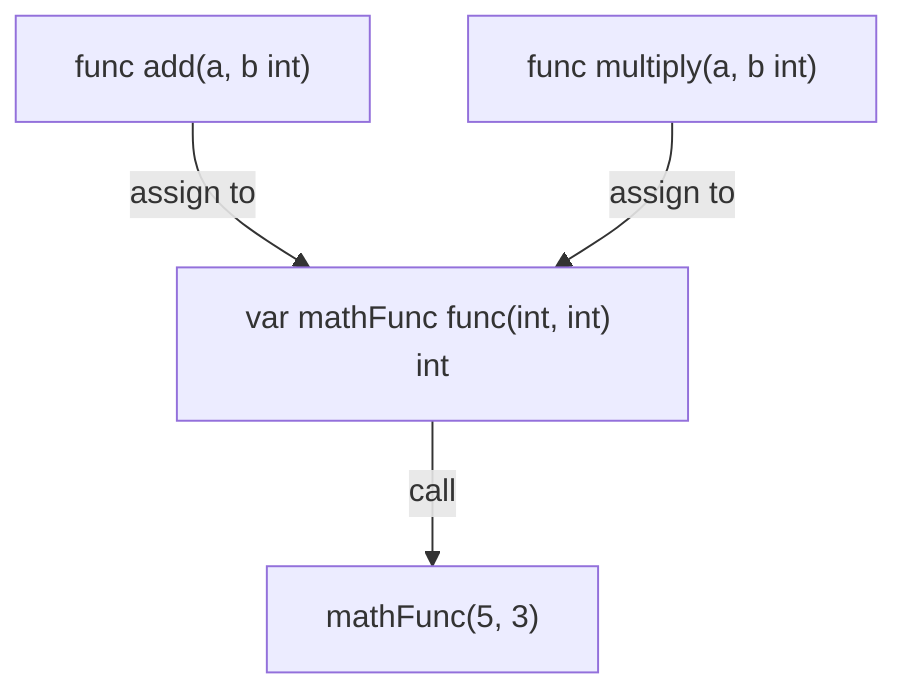

# FE.8 First-class functions

## Mission

Learn that functions are ordinary values in Go, which makes callbacks and higher-order helpers possible.

## Why This Lesson Exists Now

You know how to define functions and how to orchestrate them. But up to this point, a function has just been a static block of code that you call by name.

In Go, functions are "first-class citizens." This means they are treated like any other value (like an `int` or a `string`). You can assign them to variables, pass them into other functions, and even return them from functions. This unlocks powerful patterns like callbacks and higher-order functions.

> **Backward Reference:** In [Lesson 6: Orchestration](../6-orchestration/README.md), you hardcoded the exact helpers that `processCart` called. First-class functions let you pass the behavior *into* the function dynamically, rather than hardcoding it.

## Prerequisites

- `FE.6` orchestration

## Mental Model

A function value is just another tool you can store, pass, and call later. It is a value that holds behavior instead of data.

## Visual Model



```text
func calculate(a, b, operation)

calculate(10, 4, add) ----> 14
calculate(10, 4, multiply) -> 40
calculate(10, 4, subtract) -> 6
```

## Machine View

A function value still points at compiled code. Passing it around moves a callable reference (a pointer to the function's code in memory), not a magical new execution model. 

When you pass a function as an argument, Go is simply copying that reference. The caller can then execute the code at that reference using standard parentheses `()`.

## Run Instructions

```bash
go run ./03-functions-errors/8-first-class-functions
```

## Code Walkthrough

### `var mathFunc func(int, int) int`

This declares a variable named `mathFunc`. But instead of an `int` or a `string`, its type is a function signature: `func(int, int) int`. This variable can hold *any* function that takes two integers and returns one integer.

### `mathFunc = add`

Here, we assign the `add` function to the `mathFunc` variable. Notice that there are **no parentheses** after `add`. We are not calling the function; we are passing the function itself as a value.

### `result1 := mathFunc(5, 3)`

Now we use the variable to call the function it holds. This executes `add(5, 3)`.

### `func calculate(a int, b int, operation func(int, int) int) int {`

This is a higher-order function. It takes another function as a parameter (called `operation`). The caller must provide the behavior they want `calculate` to perform.

### `calculate(10, 4, multiply)`

We pass the `multiply` function as an argument. The `calculate` function will internally call `multiply(10, 4)`. This is often called a **callback**.

### `subtract := func(a, b int) int { ... }`

This is an **anonymous function**. We define a function without a name directly inline and assign it to the `subtract` variable.

## Try It

1. Create a `divide` function and assign it to `mathFunc`, then call it.
2. Pass your new `divide` function into `calculate`.
3. Write an anonymous function inline inside the `calculate` call itself, without assigning it to a variable first.

## Common Questions

- Can any function be assigned to any variable?
  No. The function signature (parameters and return types) must match exactly.
  
- Why not just use an `if` statement to choose the operation?
  Passing functions makes your code much more flexible. A library author can write `calculate` and let *you* provide the custom math operations.

## ⚠️ In Production

Callback-driven APIs stay readable only when function signatures are narrow and the names reveal the job each callback performs. Use first-class functions to make your code flexible, but don't overcomplicate simple branching logic.

## 🤔 Thinking Questions

1. What problem does this topic solve?
2. What breaks if this boundary is handled implicitly instead of explicitly?
3. Where would you expect to use this topic in production Go code?

> **Forward Reference:** You now know how to assign anonymous functions to variables. But what happens if that anonymous function references variables from the surrounding code? In [Lesson 9: Closures - mechanics](../9-closures-mechanics/README.md), you will learn how functions can capture and remember state.

## Next Step

Continue to `FE.9` closures - mechanics.
