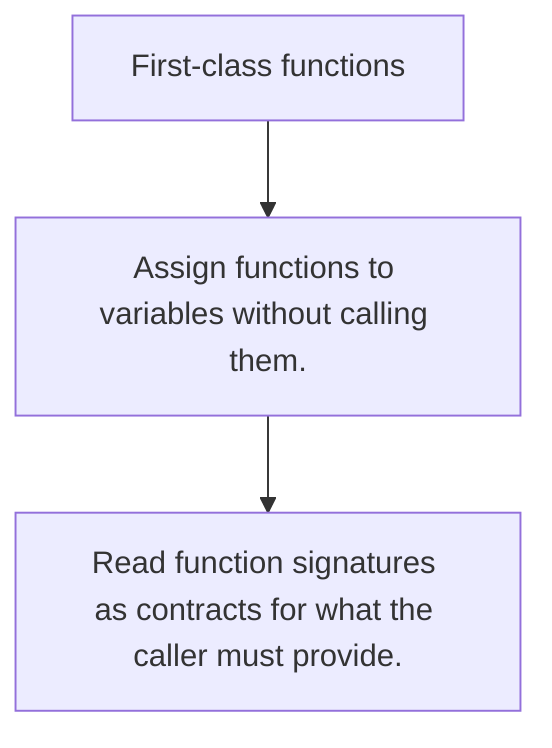

# FE.8 First-class functions

## Mission

Learn that functions are ordinary values in Go, which makes callbacks and higher-order helpers possible.

## Prerequisites

- none

## Mental Model

A function value is just another tool you can store, pass, and call later.

## Visual Model



## Machine View

A function value still points at compiled code. Passing it around moves a callable reference, not a magical new execution model.

## Run Instructions

```bash
go run ./03-functions-errors/8-first-class-functions
```

## Code Walkthrough

### Assign functions to variables without calling them.

Assign functions to variables without calling them.

### Pass behavior into other functions with callback param

Pass behavior into other functions with callback parameters.

### Read function signatures as contracts for what the cal

Read function signatures as contracts for what the caller must provide.

## Try It

1. Change one of the example inputs and rerun the lesson.
2. Explain which boundary the lesson is trying to make explicit.
3. Describe how you would apply FE.8 in a small service or tool.

## ⚠️ In Production

Callback-driven APIs stay readable only when function signatures are narrow and the names reveal the job each callback performs.

## 🤔 Thinking Questions

1. What problem does this topic solve?
2. What breaks if this boundary is handled implicitly instead of explicitly?
3. Where would you expect to use this topic in production Go code?

## Next Step

Continue to `FE.9`.
