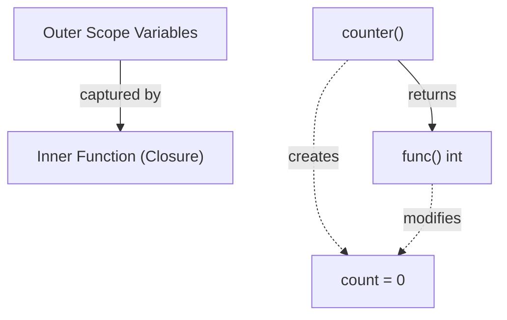

# FE.9 Closures - mechanics

## Mission

Learn how closures capture variables, why that extends lifetimes, and where the loop-variable trap comes from.

## Why This Lesson Exists Now

You have seen that functions can be assigned to variables and passed around. But what happens if an anonymous function references variables from the surrounding code?

Go functions can capture the variables they use from outside their own body. This is called a **closure**. Closures are powerful because they let functions "remember" state.

> **Backward Reference:** In [Lesson 8: First-Class Functions](../8-first-class-functions/README.md), you learned that a function is a value. Closures extend this concept by proving that a function value carries along the surrounding variables it references, keeping them alive as long as the function needs them.

## Prerequisites

- `FE.8` first-class functions

## Mental Model

A closure remembers variables from the scope where it was created, not just the values you expected in that moment.

## Visual Model



```text
nextID := counter() // creates state

nextID() -> 1
nextID() -> 2
nextID() -> 3

// The function 'remembers' the count between calls.
```

## Machine View

Captured variables can outlive the surrounding function because the Go runtime keeps the needed state reachable for the closure.

Normally, when a function finishes, its local variables are destroyed. But if an inner closure references an outer variable, Go automatically moves that variable to the **heap** so it stays alive as long as the closure exists.

## Run Instructions

```bash
go run ./03-functions-errors/9-closures-mechanics
```

## Code Walkthrough

### `func counter() func() int {`

This is a function that returns another function. Notice the return type: `func() int`.

### `count := 0`

This variable is defined in the outer scope, inside `counter` but outside the returned function.

### `return func() int { count++; return count }`

The returned anonymous function uses the `count` variable. It "closes over" it. When `counter()` finishes, `count` is not destroyed because the returned function still needs it.

### `sayHello := func() { fmt.Printf(..., message) }`

This is a simple closure capturing the `message` string.

### `message = "Goodbye"`

When the outer code changes `message`, the closure sees the change. The closure does not store a copy of the variable at the moment it was created; it holds a reference to the exact same variable in memory.

### `funcs = append(funcs, func() { fmt.Printf(..., val) })`

This is the classic loop capture pattern. In Go 1.22 and newer, loop variables are created per-iteration, so capturing `i` directly usually works exactly as you'd expect. However, explicitly rebinding `val := i` is still a useful habit when you want to make the captured scope explicitly clear to future readers of older codebases.

## Try It

1. Create a second `anotherCounter := counter()` in `main()`. Call it a few times and observe that it maintains its own separate `count`.
2. Add a `multiplier` function that takes an integer `factor` and returns a `func(int) int` which multiplies its input by the captured `factor`.

## Common Questions

- Do closures take up memory?
  Yes. The captured variables are moved to the heap, which means they use memory until the closure is no longer needed and gets garbage collected.
  
- Why didn't `add` or `multiply` in the last lesson capture state?
  They didn't reference any variables from outside their own bodies.

## In Production
Closure bugs are usually state bugs. The most common one is reusing the same loop variable across multiple callbacks or goroutines. Always be mindful of *what* your closure is capturing.

## Thinking Questions
1. What problem does this topic solve?
2. What breaks if this boundary is handled implicitly instead of explicitly?
3. Where would you expect to use this topic in production Go code?

> **Forward Reference:** You now understand functions, errors, validation, orchestration, and closures. But what happens when the program encounters a truly unrecoverable state? In the final lesson of this section, [Lesson 10: Panic and Recover](../10-panic-and-recover/README.md), you will learn about Go's emergency stop mechanism.

## Next Step

Continue to `FE.10` panic and recover.
