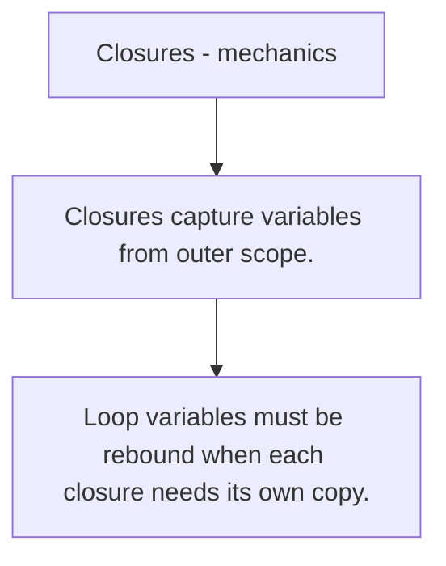

# FE.9 Closures - mechanics

## Mission

Learn how closures capture variables, why that extends lifetimes, and where the loop-variable trap comes from.

## Prerequisites

- FE.8

## Mental Model

A closure remembers variables from the scope where it was created, not just the values you expected in that moment.

## Visual Model



## Machine View

Captured variables can outlive the surrounding function because the runtime keeps the needed state reachable for the closure.

## Run Instructions

```bash
go run ./03-functions-errors/9-closures-mechanics
```

## Code Walkthrough

### Closures capture variables from outer scope.

Closures capture variables from outer scope.

### Captured state stays alive as long as the closure can 

Captured state stays alive as long as the closure can still use it.

### Loop variables must be rebound when each closure needs

Loop variables must be rebound when each closure needs its own copy.

## Try It

1. Change one of the example inputs and rerun the lesson.
2. Explain which boundary the lesson is trying to make explicit.
3. Describe how you would apply FE.9 in a small service or tool.

## ⚠️ In Production

Closure bugs are usually state bugs. The most common one is reusing the same loop variable across multiple callbacks or goroutines.

## 🤔 Thinking Questions

1. What problem does this topic solve?
2. What breaks if this boundary is handled implicitly instead of explicitly?
3. Where would you expect to use this topic in production Go code?

## Next Step

Continue to `FE.10`.
