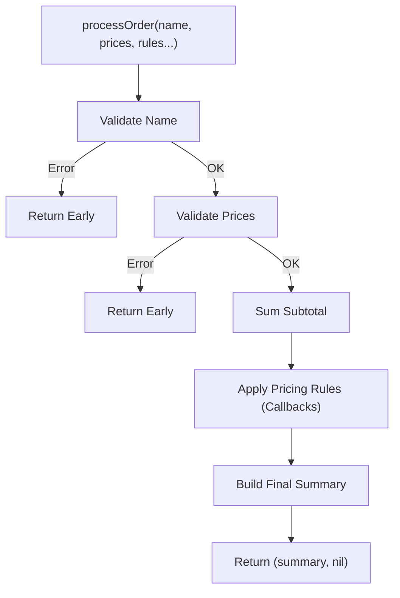

# FE.7 Order Summary (Milestone)

## Mission

Build a complete order-processing pipeline that combines validation, orchestration, first-class functions, and closures into one professional workflow.

## Prerequisites

- `FE.1` through `FE.6` (Basics to Orchestration)
- `FE.8` first-class functions
- `FE.9` closures mechanics

## Mental Model

Think of this milestone as a **Business Logic Pipeline**.
Data flows through several stages:
1. **Validation**: Ensuring data integrity early.
2. **Calculation**: Performing core math (summing prices).
3. **Policy Application**: Applying dynamic rules (discounts) passed in as callbacks.
4. **Formatting**: Creating the final human-readable output.

The goal is to keep the "Happy Path" clean while handling every possible error explicitly.

> [!NOTE]
> This is the capstone exercise for Section 03. It brings together everything you've learned. You will see how independent concepts like multiple returns and closures cooperate to build a maintainable production-shaped system.

## Visual Model



## Machine View

This program demonstrates complex **Call Stack** management and **Heap** allocation:
- The `processOrder` orchestrator holds the intermediate `subtotal` on its stack frame.
- It iterates over a slice of `pricingRule` functions.
- One of those rules is a **Closure** created by `makeMinimumSubtotalDiscount`. This closure carries its `threshold` and `amount` data on the **Heap**, allowing it to apply the correct logic even though the factory function that created it has already returned.

## Run Instructions

```bash
go run ./03-functions-errors/9-order-summary
go test ./03-functions-errors/9-order-summary
```

## Solution Walkthrough

- **`pricingRule` type**: A function signature used to treat behavior as data.
- **Validation Helpers**: Focused functions that return only an `error`.
- **`applyPricingRules`**: A higher-order function that executes a sequence of callbacks.
- **`makeMinimumSubtotalDiscount`**: A closure factory that captures configuration state.
- **`processOrder`**: The orchestrator that ensures valid data reaches the calculation stage and handles "short-circuit" error returns.

> [!TIP]
> You have mastered the "happy path" and the "ordinary failure path" using errors. But what happens when the program encounters a truly unrecoverable state? In the final lesson of this section, [FE.10 Panic and Recover](../10-panic-and-recover/README.md), you will learn about Go's emergency stop mechanism.

## Try It

1. Add a new pricing rule (anonymous function) that adds a flat $2 "Processing Fee" if the total is above $100.
2. Modify the `starter cart` prices to trigger a validation error. Observe how the program stops before calculating anything.
3. Add a unit test in `main_test.go` that verifies the `vipDiscount` logic specifically.

## Verification Surface

```bash
go run ./03-functions-errors/9-order-summary
go test ./03-functions-errors/9-order-summary
```

## In Production

This "Validate -> Calculate -> Apply Policy -> Format" pattern is the standard architecture for:
- **E-commerce Checkout Engines**
- **Billing and Invoicing Systems**
- **Complex Financial Workflows**
By keeping the policies (discounts, fees) as callbacks, the core engine remains unchanged even as business rules evolve.

## Thinking Questions

1. Why is it better to pass `pricingRule` functions rather than hardcoding discount logic inside `processOrder`?
2. How does explicit error handling make this pipeline easier to debug than one using `try/catch`?
3. What happens to the captured `threshold` variable if the `vipDiscount` function is never called?

## Next Step

Next: `FE.10` -> [`03-functions-errors/10-panic-and-recover`](../10-panic-and-recover/README.md)
