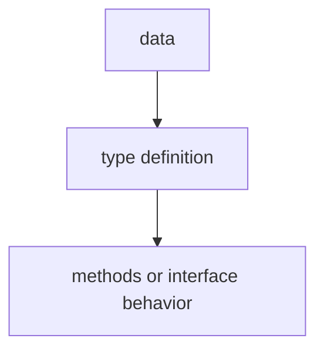

# TI.1 Structs

## Mission

Learn what a struct is and how to use it to group related data together into a single type.

## Why This Lesson Exists Now

You have been working with individual values (numbers, text, booleans) and collections (slices, maps). But real-world data is often structured. A server has an ID, hostname, IP, region, CPU cores, memory, status, and boot time. Scattering these across separate variables is messy and error-prone.

That is what structs do.

> **Backward Reference:** In [Lesson 10: Panic and Recover](../../03-functions-errors/10-panic-and-recover/README.md), you learned how to handle catastrophic failures. Now that you can safely manage the execution flow of your functions, you are ready to learn how to design the data structures those functions operate on.

## Prerequisites

- `FE.10` panic and recover

## Mental Model

Think of a struct like a passport. A passport groups related data about one person: name, nationality, date of birth, photo, passport number. You would not scatter this data across 6 separate variables-you would put it in one structured document. That is exactly what a struct does in code.

## Visual Model



| Field Name | Type        |
| ---------- | ----------- |
| `ID`       | `int`       |
| `Hostname` | `string`    |
| `IP`       | `string`    |
| `Region`   | `string`    |
| `CPUCores` | `int`       |
| `MemoryGB` | `int`       |
| `IsOnline` | `bool`      |
| `BootedAt` | `time.Time` |

## Machine View

Go lays out struct fields contiguously in memory. The compiler may add "padding" bytes between fields for alignment. Ordering fields from largest to smallest can reduce memory usage.

At this stage, you do not need to think about exact memory layout. What matters is understanding that a struct is a composite type that groups multiple values together.

## Run Instructions

```bash
go run ./04-types-design/1-struct
```

## Code Walkthrough

### `type Server struct {`

This defines a new type named `Server`. The struct keyword means we are defining a composite type with multiple named fields.

### `ID int`

Each line inside the struct defines one field: a name, a type, and an optional comment. Order matters for memory layout, but for now, just list fields logically.

### `NewServer(...)`

Go does not have classes or constructors. Instead, by convention, functions that create types are named `New<Type>`. They validate inputs and set sensible defaults.

### `webServer := Server{...}`

This creates a struct instance with named fields. The order does not matter. Any field you omit gets its zero value.

### `webServer.Hostname`

Access fields with dot notation: structVar.FieldName.

## Try It

1. Add a new field to the Server struct (e.g., `Port int`) and update the initialization.
2. Create a second Server instance and compare them.
3. Try accessing a field that was not initialized and observe the zero value.

## In Production
Structs are the foundation of data modeling in Go. Every API request, database record, and configuration object is modeled as a struct. Understanding how to design structs is essential for writing real applications.

## Thinking Questions
1. What problem is this lesson trying to solve?
2. What would change if you removed this idea from the program?
3. Where do you expect to see this pattern again in real Go code?

> **Forward Reference:** Structs group data, but they don't yet have behavior. In [Lesson 2: Methods](../2-methods/README.md), you will learn how to attach functions directly to structs, turning your data models into active components.

## Next Step

Continue to `TI.2` methods.
