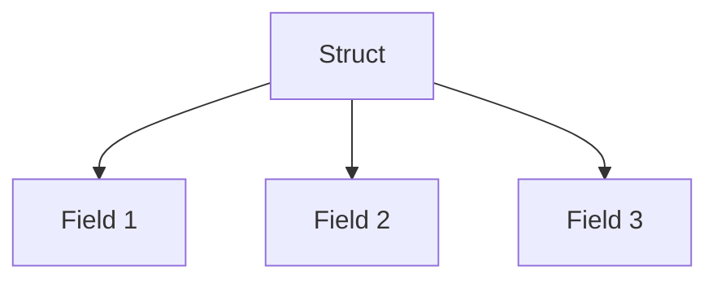

# TI.1 Structs

## Mission

- Define composite types using the `struct` keyword.
- Initialize and access struct fields using various patterns.
- Analyze the memory layout and alignment of structs.

## Prerequisites

- `FE.4` Variables and Constants

## Mental Model

A **Struct** is a typed collection of fields. It allows you to group different data types into a single named unit. Unlike an array (where all elements must be the same type), a struct can hold heterogeneous data.

## Visual Model



## Machine View

In memory, a struct is a contiguous block. The size of the struct is the sum of its field sizes plus any **Padding** inserted by the compiler to ensure fields are aligned to their natural boundaries (e.g., an 8-byte `int64` should start at an 8-byte boundary).

```text
Memory Layout of Server struct:
[ ID (8b) ][ Hostname (16b) ][ IP (16b) ][ Region (16b) ][ CPU (8b) ][ RAM (8b) ][ Online (1b) ][ Padding (7b) ][ BootedAt (24b) ]
```

Field order matters. Placing small types between large types can increase the overall size of the struct due to padding.

## Run Instructions

```bash
go run ./04-types-design/1-struct
```

## Code Walkthrough

- **Field Access**: Uses dot notation (`s.ID`).
- **Zero Values**: When a struct is declared without initialization, all fields are set to their respective zero values.
- **Constructors**: By convention, Go uses functions named `New[Type]` to return initialized and validated struct instances.
- **Pointers**: Structs are often passed by pointer (`*Server`) to avoid copying large amounts of data on the stack and to allow mutation.

> [!NOTE]
> This concept builds on the basic memory principles introduced in [Section 00](../../00-how-computers-work/README.md).

## Try It

1. In `main.go`, add a new field `Environment` (string) to the `Server` struct.
2. Update the `NewServer` constructor to accept and set this new field.
3. Observe how the zero-value output changes for the `emptyServer` variable.

## In Production

- **Configuration**: Mapping environment variables or JSON files to internal structures.
- **Domain Models**: Representing entities like Users, Accounts, or Products in a database.
- **API Responses**: Defining the shape of data sent over the network.

## Thinking Questions

1. How does Go's zero-value initialization improve system safety compared to languages with uninitialized memory?
2. Why does the compiler insert padding into a struct instead of packing the data as tightly as possible?
3. In what scenario would you prefer passing a struct by value instead of by pointer?

## Next Step

Next: `TI.2` -> [`04-types-design/2-methods`](../2-methods/README.md)
