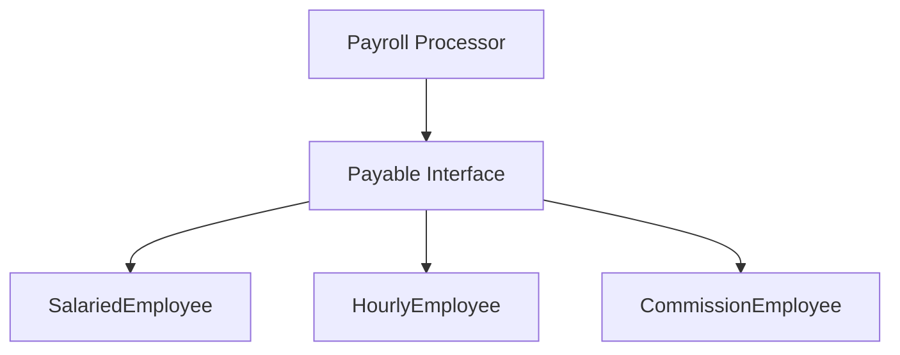

# TI.10 Case Study: Payroll Processor

## Mission

- Design behavioral contracts using Go interfaces.
- Implement polymorphic processing logic for heterogeneous types.
- Embed standard library interfaces (`fmt.Stringer`) into custom contracts.
- Understand how interface values facilitate decoupling in complex systems.

## Prerequisites

- `TI.3` Interfaces
- `TI.5` Stringer

## Mental Model

In real-world applications, systems must often process varied data models through a single, unified workflow. In this case study, we build a payroll processor that handles multiple employee types (Salaried, Hourly, Commission). By defining a `Payable` interface, the processor can treat all employee types uniformly, relying on the **contract** rather than the **concrete implementation**.

## Visual Model



## Machine View

When a concrete type (e.g., `HourlyEmployee`) is passed to a function accepting `Payable`, the Go runtime creates an **interface value**. This value contains two pointers: one to the concrete data and one to the "itabs" (interface table) which maps the interface methods to the concrete type's implementation. Method calls on the interface dispatch to the correct formulas at runtime without requiring type assertions.

## Run Instructions

```bash
go run ./04-types-design/10-payroll-processor
```

## Solution Walkthrough

### The Behavioral Contract

The `Payable` interface requires a `CalculatePay` method and embeds `fmt.Stringer` to ensure reporting capabilities.

```go
type Payable interface {
    fmt.Stringer
    CalculatePay() float64
}
```

### Polymorphic Processing

The `ProcessPayroll` function operates on a slice of `Payable` interfaces. It does not know the internal details of how pay is calculated for each employee; it simply invokes the method promised by the contract.

```go
func ProcessPayroll(employees []Payable) {
    for _, emp := range employees {
        pay := emp.CalculatePay() // Runtime dispatch
    }
}
```

## Try It

### Automated Tests

```bash
go test ./04-types-design/10-payroll-processor
```

## Verification Surface

- Add a new `Contractor` struct that implements `CalculatePay()`.
- Add a `Contractor` instance to the `payrollList` in `main.go`.
- Run the program and verify that the payroll processor correctly handles the new type without any modification to the `ProcessPayroll` function.

## In Production

- **Payment Gateways**: Processing transactions through Stripe, PayPal, or Bank transfers using a `Processor` interface.
- **Logging Systems**: Sending logs to File, Console, or S3 using a `Logger` interface.
- **Plugin Architectures**: Extending core functionality by implementing required behavioral contracts.

## Thinking Questions

1. How does using an interface here differ from using a base class in an inheritance-based language?
2. Why is embedding `fmt.Stringer` into `Payable` a good design choice for a reporting system?
3. What would happen if you removed the `CalculatePay()` method from one of the employee types?

## Next Step

Next: `CO.1` -> [`04-types-design/16-composition`](../16-composition/README.md)
