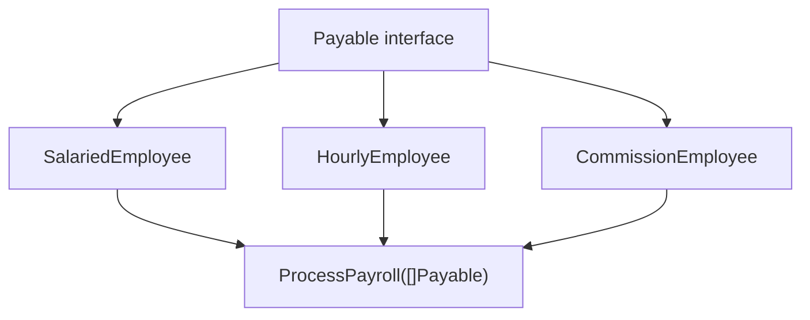

# TI.10 Payroll Processor Project

## Mission

Build a small payroll processor that proves different employee types can share one behavior contract through interfaces instead of inheritance.

> **Backward Reference:** In [Lesson 9: Generics](../9-generics/README.md), you learned how to write code that is generic across types. Now, you will combine everything you have learned about structs, methods, interfaces, and generics to build a complete, realistic system.

## Prerequisites

- `TI.1` structs
- `TI.2` methods
- `TI.3` interfaces
- `TI.5` Stringer
- `TI.9` generics

## Mental Model

Different employee types may store different data, but they can still satisfy the same interface if they promise the same behavior. The payroll processor depends on the contract, not on one concrete type.

## Visual Model



## Machine View

When a concrete employee value is stored behind an interface, Go keeps both type information and a value reference. Method calls on the interface dispatch to the correct concrete implementation at runtime.

## Run Instructions

```bash
go run ./04-types-design/10-payroll-processor
go run ./04-types-design/10-payroll-processor/_starter
go test ./04-types-design/10-payroll-processor
```

## Solution Walkthrough

### `type Payable interface { ... }`

The interface defines the shared behavior the payroll processor needs.

### Concrete employee structs

Each employee type stores different fields but implements the same pay-calculation contract.

### Receiver methods

Each concrete type calculates pay in its own way while still satisfying the same interface.

### Generic helper

The small generic helper demonstrates reuse without turning the exercise into a generics lesson.

### `ProcessPayroll(employees []Payable)`

This function loops over mixed employee types and treats them uniformly through the interface.

## Try It

1. Add another employee type and see if `ProcessPayroll` still works without changes.
2. Change one receiver type and confirm the behavior still makes sense.
3. Add another field to one employee type and update its `String()` output.

## Verification Surface

```bash
go run ./04-types-design/10-payroll-processor
go run ./04-types-design/10-payroll-processor/_starter
go test ./04-types-design/10-payroll-processor
```

## In Production
Interface-driven processing is how Go code stays flexible without inheritance trees. Payment systems, storage layers, transports, and workers all benefit when callers depend on behavior contracts instead of concrete implementations.

## Thinking Questions
1. Why is the payroll processor better off depending on `Payable` than on one employee struct?
2. What changes when a value is stored behind an interface?
3. Why is the generic helper useful here but not the main point of the exercise?

> **Forward Reference:** You have seen how interfaces allow for safe polymorphism. Sometimes, however, you need to work with values where the type is truly unknown. In [Lesson 11: Dynamic Typing with any](../11-dynamic-typing-with-any/README.md), you will explore the "empty interface" and the risks and rewards of dynamic typing in Go.

## Next Step

Continue to `TI.11` dynamic-typing-with-any.
