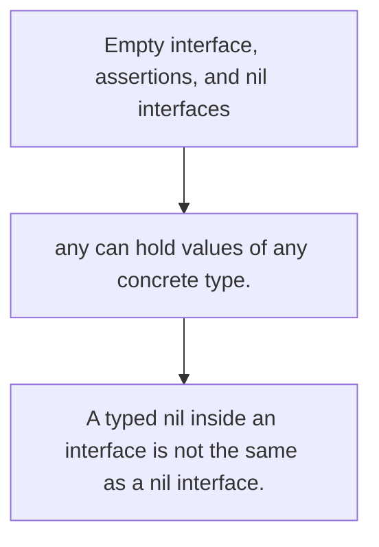

# TI.11 Empty interface, assertions, and nil interfaces

## Mission

Learn how `any` works, how to extract concrete types safely, and why typed nil values can still make an interface non-nil.

## Prerequisites

- TI.3

## Mental Model

An interface value carries both a dynamic type and a dynamic value. Bugs appear when you forget that it needs both pieces.

## Visual Model



## Machine View

The runtime stores interface values as a pair of type metadata and data pointer. Assertions inspect the type half; nil pitfalls come from a non-nil type paired with a nil value.

## Run Instructions

```bash
go run ./04-types-design/11-dynamic-typing-with-any
```

## Code Walkthrough

### `any` can hold values of any concrete type.

`any` can hold values of any concrete type.

### Type assertions and type switches recover concrete beh

Type assertions and type switches recover concrete behavior safely.

### A typed nil inside an interface is not the same as a n

A typed nil inside an interface is not the same as a nil interface.

## Try It

1. Store several concrete values in one `any` slice and inspect them with a type switch.
2. Change one assertion to the unsafe form and predict where it would panic.
3. Return a typed nil pointer from a function and compare it with a nil interface.

## ⚠️ In Production

Dynamic values are useful at boundaries like logging, decoding, and plugin-style APIs, but they demand careful guards around assertions and nil checks.

## 🤔 Thinking Questions

1. Why does an interface need both type and value information?
2. When should you prefer generics over `any`?
3. Why can `value == nil` be misleading for interface values?

## Next Step

Continue to `TI.12`.
