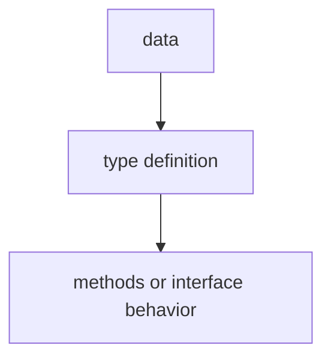

# TI.12 Functional Options

## Mission

Learn the functional options pattern-a common Go pattern for building configurable APIs without requiring many constructor parameters.

> **Backward Reference:** In [Lesson 11: Dynamic Typing with any](../11-dynamic-typing-with-any/README.md), you learned about the flexibility of the `any` type. Functional options provide another kind of flexibility-designing APIs that are easy to use, extend, and maintain without sacrificing type safety.

## Why This Lesson Exists Now

When a type has many optional fields, passing all of them to a constructor becomes unwieldy. The functional options pattern lets callers customize only what they need using small, composable functions.

## Prerequisites

- `TI.2` methods

## Mental Model

Think of ordering a pizza. You could have a constructor with 20 parameters (crust, sauce, cheese, toppings, size, etc.). Or you could have `WithExtraCheese()`, `WithPepperoni()`, `LargeSize()` functions that you chain together. Much cleaner!

## Visual Model


```go
// Without options: too many parameters
NewServer("web", "us-east", 4, 16, true, false, "linux", "10.0.0.1", ...)

// With functional options
NewServer(
    WithName("web"),
    WithRegion("us-east"),
    WithCPUs(4),
)
```

## Machine View

Each option is just a function that mutates or configures one target value. The pattern feels higher-level, but underneath it is still ordinary function calls applied one by one.

## Run Instructions

```bash
go run ./04-types-design/12-functional-options
```

## Code Walkthrough

### Option type

Define a function type that modifies a config struct.

### Option function

Each option function returns an Option that gets applied.

### WithDefault pattern

Use functional composition to build up configuration.

## Try It

1. Add a new option function for a missing field.
2. Create a server with multiple options chained together.
3. Make some options have default values.

## In Production
Functional options are used throughout Go APIs-gRPC, Terraform provider, Cobra CLI, etc. Essential for building clean, extensible libraries.
Functional options are used throughout Go APIs-gRPC, Terraform provider, Cobra CLI, etc. Essential for building clean, extensible libraries.

## Thinking Questions
1. What problem is this lesson trying to solve?
2. What would change if you removed this idea from the program?
3. Where do you expect to see this pattern again in real Go code?

> **Forward Reference:** We have seen how to attach behavior to types and how to configure them. Now, we will look at how to treat that behavior itself as a first-class value. In [Lesson 13: Method Values](../13-method-values/README.md), you will learn how to extract and pass around a method as if it were a regular function.

## Next Step

Continue to `TI.13` method-values.
