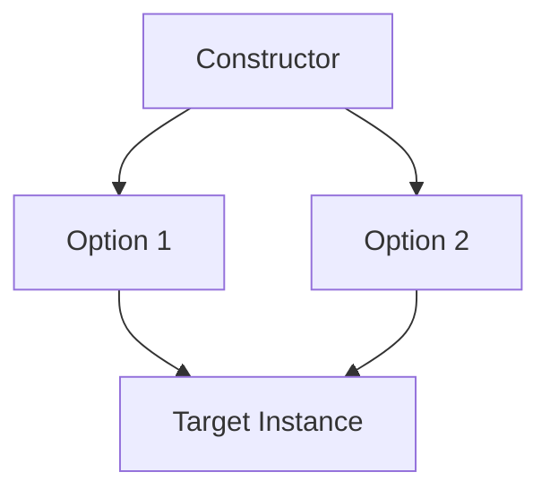

# TI.12 Functional Options

## Mission

- Implement the functional options pattern for flexible, type-safe constructors.
- Manage default states in complex data structures.
- Utilize variadic functions and closures for declarative configuration logic.
- Build extensible APIs that maintain backward compatibility as new options are added.

## Prerequisites

- `TI.2` Methods

## Mental Model

As types grow in complexity, traditional constructors (e.g., `NewServer(name, cpu, ram, ...)`) become fragile and difficult to maintain. Adding a new configuration field requires breaking the signature for all existing callers. The **functional options pattern** solves this by using variadic functions that modify a target configuration struct. Callers specify only the options they need, while the constructor applies sensible defaults for the rest.

## Visual Model



## Machine View

A functional option is simply a function with the signature `func(*Target)`. When `NewServer` is invoked with multiple options, the Go runtime executes each function in sequence, passing a pointer to the newly allocated instance. This pattern utilizes **closures** to capture the configuration values (like `name` or `cpu` count) and apply them to the target instance at instantiation time.

## Run Instructions

```bash
go run ./04-types-design/12-functional-options
```

## Code Walkthrough

### The Option Type

We define a function type that acts as the contract for all configuration options.

```go
type Option func(*Server)
```

### Option Constructors

Each option is a higher-order function that returns a closure.

```go
func WithCPUs(n int) Option {
    return func(s *Server) {
        s.CPUs = n
    }
}
```

### Variadic Instantiation

The constructor accepts a variadic slice of options and applies them after setting defaults.

```go
func NewServer(opts ...Option) *Server {
    s := &Server{ /* defaults */ }
    for _, opt := range opts {
        opt(s)
    }
    return s
}
```

## Try It

### Automated Tests

```bash
go test ./...
```

### Manual Verification

- Instantiate a `Server` with no options and verify it has the expected default CPU and RAM values.
- Chain multiple options together and verify the resulting struct matches the declarative intent.

## In Production

- **gRPC Server Configuration**: Setting timeouts, interceptors, and security credentials.
- **HTTP Clients**: Configuring retry policies, headers, and connection pooling.
- **CLI Tools**: Initializing complex command structures with optional flags.

## Thinking Questions

1. Why is the functional options pattern better for backward compatibility than a configuration struct?
2. How do closures enable the "capture" of configuration data in this pattern?
3. What are the performance trade-offs of using function calls for configuration vs. direct struct field assignment?

---

## Next Step

Next: `TI.13` -> [`04-types-design/13-method-values`](../13-method-values/README.md)
**PREVIOUS:** TI.11 -> [Dynamic Typing with any](../11-dynamic-typing-with-any/README.md)
