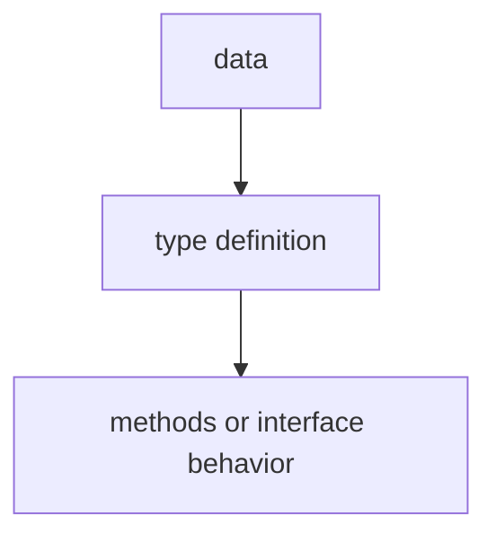

# TI.13 Method Values

## Mission

Learn how to treat methods as first-class values—assigning methods to variables and passing them as function arguments.

## Why This Lesson Exists Now

In Go, methods can be extracted from their receiver and used as values. This is useful for callbacks, event handlers, and deferred function calls.

## Prerequisites

- `TI.2` methods

## Mental Model

Think of a button on a remote. You can press the button (call the method), or you can program the button to trigger something else (use the method as a value). Method values let you treat the button itself as a thing you can store and use later.

## Visual Model


```go
type Counter struct{ Value int }

func (c *Counter) Increment() { c.Value++ }

// Method as value - the receiver is bound
counter := &Counter{}
incFunc := counter.Increment // This is a func()
// Calling it later
incFunc()
incFunc()
fmt.Println(counter.Value) // 2
```

## Machine View

When you capture a method value, Go binds the receiver to that function value. Calling the stored function later is like calling the original method with the same receiver already attached.

## Run Instructions

```bash
go run ./04-types-design/13-method-values
```

## Code Walkthrough

### Extracting a method

`obj.Method` returns a function value with the receiver bound.

### Using method values

Pass method values to functions that expect func().

### Method values vs closures

Method values capture the receiver; closures capture variables.

## Try It

1. Store a method in a map of event handlers.
2. Pass a method value to a defer statement.
3. Compare method values with closures capturing the same receiver.

## ⚠️ In Production
Method values are used in HTTP handlers, event systems, and anywhere you need to pass a method as a callback.

## 🤔 Thinking Questions

1. What problem is this lesson trying to solve?
2. What would change if you removed this idea from the program?
3. Where do you expect to see this pattern again in real Go code?
## Next Step

Continue to `TI.14` complex generic constraints if you want to finish the optional stretch path.
