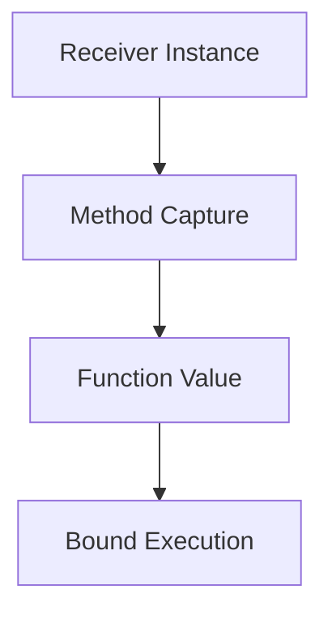

# TI.13 Method Values

## Mission

- Extract methods from receivers to create first-class function values.
- Understand the internal mechanics of receiver binding in method values.
- Utilize method values as decoupled callbacks and event handlers.
- Manage instance-specific behaviors using bound function variables.

## Prerequisites

- `TI.2` Methods
- `FE.8` Functions and Closures

## Mental Model

In Go, methods are not merely functions attached to types; they are first-class citizens that can be "extracted" from their receiver instances. When a method is assigned to a variable (e.g., `fn := obj.Method`), Go creates a **method value**. This value is a function that carries a permanent reference to the original receiver instance, allowing the method to be executed later without the caller needing to know about the underlying object.

## Visual Model



## Machine View

A method value is internally represented as a small structure that contains two pointers: one to the function's executable code and one to the receiver instance. When the function value is invoked, the Go runtime automatically passes the stored receiver pointer as the first argument (the receiver) to the function, effectively "binding" the state to the behavior.

## Run Instructions

```bash
go run ./04-types-design/13-method-values
```

## Code Walkthrough

### Basic Binding

When you capture a method value, the receiver's state is preserved. If the method has a pointer receiver, the function value points to the original object.

```go
counter := &Counter{Value: 10}
incFunc := counter.Increment // incFunc is now func()
incFunc()                    // Increments counter.Value to 11
```

### Methods as Callbacks

Method values satisfy function signatures, making them ideal for injection into higher-order functions or event loops.

```go
func runHandler(fn func()) {
    fn()
}

// Pass the method value directly
runHandler(button.OnClick)
```

## Try It

### Automated Tests

```bash
go test ./...
```

### Manual Verification

- Create two instances of a struct, capture the same method from both into different variables, and verify that calling each variable only affects its respective instance.
- Pass a method value to a `defer` statement and confirm it executes with the correct receiver state at the end of the function.

## In Production

- **HTTP Middleware**: Binding database or logger instances to handler methods.
- **UI Frameworks**: Connecting widget events (OnClick, OnHover) to specific controller methods.
- **Task Orchestration**: Passing specific worker methods to a generic execution pool.

## Thinking Questions

1. How does a method value differ from a closure that wraps a method call?
2. What happens to a method value if the underlying receiver instance is garbage collected? (Hint: The method value holds a reference).
3. Why might you choose a method value over an interface for a simple callback?

---

## Next Step

Next: `TI.10` -> [`04-types-design/10-payroll-processor`](../10-payroll-processor/README.md)
