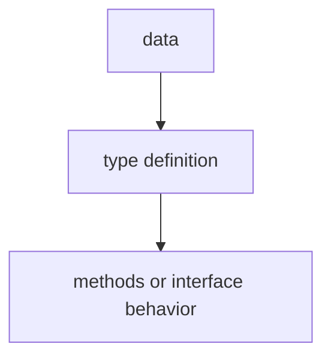

# TI.13 Nil Interfaces

## Mission

Learn about nil interfaces, how they behave differently from typed nils, and how to handle them correctly.

## Why This Lesson Exists Now

Interfaces can hold nil values, but they can also be nil themselves. These are different things! Understanding this difference prevents subtle bugs and panics.

## Prerequisites

- `TI.3` interfaces

## Mental Model

Think of a pointer to a file. You can have:
1. A nil pointer (no file opened at all)
2. A pointer to an open file handle that happens to be closed

With interfaces, it's similar—nil interface vs interface holding a nil pointer.

## Visual Model


```go
var i1 interface{} = nil        // truly nil interface
var i2 interface{} = (*int)(nil) // interface holding typed nil
```

## Machine View

An interface has two fields: type and value. When both are nil, the interface is nil. When type is set but value is nil, the interface is NOT nil—it contains a typed nil.

## Run Instructions

```bash
go run ./04-types-design/13-nil-interfaces
```

## Code Walkthrough

### Truly nil interface

Both type and value are nil.

### Interface holding typed nil

Type is set, but value is nil—this is not equal to nil!

### Checking for nil

Always check if interface is nil before using it.

### Guarding typed nils

If an interface may contain a typed nil pointer, a plain `value == nil` check is not enough. Add a second guard for the concrete pointer type before calling its methods.

## Try It

1. Create a function that returns an interface and see when it's nil vs typed nil.
2. Pass a nil pointer to an interface parameter and observe behavior.
3. Write a guard clause that checks for both nil interface and typed nil.

## ⚠️ In Production
Nil interface handling is crucial when working with database results, file operations, and any function that may return nothing or error.

## 🤔 Thinking Questions

1. What problem is this lesson trying to solve?
2. What would change if you removed this idea from the program?
3. Where do you expect to see this pattern again in real Go code?
## Next Step

Continue to `TI.14` functional options.
