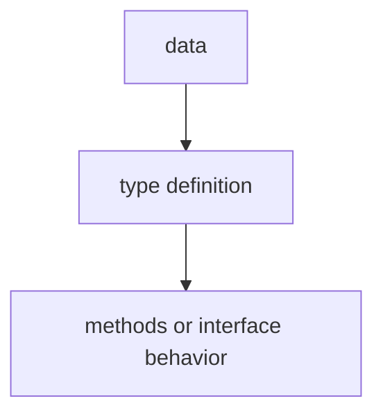

# TI.14 Complex Generic Constraints

## Mission

Learn advanced constraint patterns including parameterized constraints, interfaces as constraints, and reusable generic utilities.

## Why This Lesson Exists Now

You know basic generics with simple constraints like `int | float64`. But real-world code often needs more sophisticated constraints - constraints that require methods, parameterized types, or multiple interface requirements.

## Prerequisites

- `TI.9` generics

## Mental Model

Think of a vending machine that accepts only certain payment methods. The constraint is not just "some type" - it is "anything with a `Pay()` method that returns an error." Similarly, generic constraints can require methods, not just type identity.

## Visual Model



```go
// Constraint requiring methods
type Adder interface {
    Add(other int) int
}

// Constraint requiring multiple interfaces
type Serializer interface {
    fmt.Stringer
    json.Marshaler
}
```

## Machine View

Constraints are checked by the compiler before the program runs. They do not add dynamic type checks at each call site. They define which concrete types are allowed when the generic code is instantiated.

## Run Instructions

```bash
go run ./04-types-design/14-complex-generic-constraints
```

## Code Walkthrough

### Interface as constraint

Interfaces can be constraints - anything implementing the interface works.

### Multiple interface constraints

Use embedded interfaces to require multiple behaviors.

### Comparable constraint

The built-in `comparable` constraint allows equality operators.

## Try It

1. Create a constraint that requires both `String()` and a custom method.
2. Use the `comparable` constraint to create a generic key-value pair.
3. Build a constraint for numeric types with multiple operations.

## In Production

Complex constraints are used in real Go code for data structures, serialization, and anywhere you need type-safe generic utilities.

## Thinking Questions

1. What problem is this lesson trying to solve?
2. What would change if you removed this idea from the program?
3. Where do you expect to see this pattern again in real Go code?

## Next Step

Continue to `TI.15` generic data structures.
