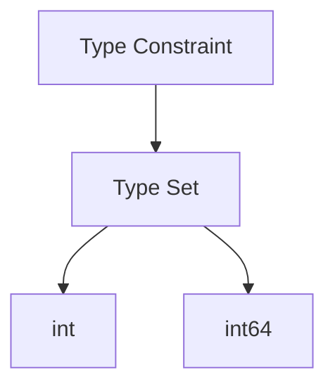

# TI.14 Complex Generic Constraints

## Mission

- Define complex type constraints using method-based interfaces.
- Compose multiple behaviors into a single generic requirement.
- Utilize the `comparable` constraint for map-key operations.
- Understand the distinction between static satisfaction and dynamic dispatch.

## Prerequisites

- `TI.9` Generics

## Mental Model

In basic generics, constraints are often simple type unions (e.g., `int | float64`). However, production-grade generic logic frequently requires specific **behavioral contracts**. Complex constraints allow engineers to define these contracts using interfaces, ensuring that any type parameter `T` possesses the necessary methods to execute the generic logic safely.

## Visual Model



## Machine View

Generic constraints are enforced at **compile-time**. When a generic function is called, the Go compiler verifies that the concrete type provided satisfies all requirements defined by the constraint interface. This results in type-safe, monomorphized machine code where behavioral requirements are baked into the executable, eliminating the overhead of runtime type assertions.

## Run Instructions

```bash
go run ./04-types-design/14-complex-generic-constraints
```

## Code Walkthrough

### Method-Based Constraints

Interfaces used as constraints can require one or more methods. Any type `T` that implements these methods can be used as a type parameter.

```go
type Numeric interface {
    Add(other int) int
    Multiply(other int) int
}
```

### The `comparable` Constraint

The built-in `comparable` constraint is a special interface satisfied by all types that support equality operators (`==` and `!=`). This is mandatory for types used as map keys.

```go
func GetOrSet[K comparable, V any] (m map[K]V, key K, defaultVal V) V
```

## Try It

### Automated Tests

```bash
go test ./...
```

### Manual Verification

- Instantiate `ScaleAll` with a type that does *not* satisfy the `Numeric` interface and observe the compile-time error.
- Use `GetOrSet` with a non-comparable type (like a slice) as a key and observe the compiler rejection.

## In Production

- **Generic Cache Layers**: Using `comparable` for flexible key types.
- **Serialization Utilities**: Constraining types to those that implement `json.Marshaler` or `proto.Message`.
- **Mathematical Libraries**: Requiring specific arithmetic operations on custom numeric types.

## Thinking Questions

1. Why are constraints checked at compile-time rather than runtime?
2. What are the limitations of the `comparable` constraint?
3. How does interface embedding simplify complex generic requirements?

---

## Next Step

Next: `TI.15` -> [`04-types-design/15-generic-data-structures`](../15-generic-data-structures/README.md)
