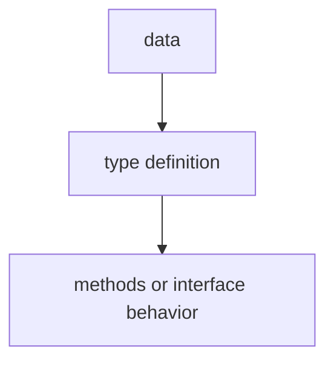

# TI.15 Generic Data Structures

## Mission

Learn to build type-safe generic data structures like Stack, Queue, and Set using Go's generics.

## Why This Lesson Exists Now

You've learned generic functions. Now learn to build generic data structures that are type-safe at compile time-no runtime type assertions needed.

> **Backward Reference:** In [Lesson 14: Complex Generic Constraints](../14-complex-generic-constraints/README.md), you learned how to define sophisticated rules for your generic types. Now, we will apply those rules to build reusable, type-safe data structures that can hold any type satisfying your requirements.

## Prerequisites

- `TI.9` generics
- `TI.14` complex-generic-constraints

## Mental Model

Think of a reusable storage box. Without generics, you'd need separate boxes for books, clothes, and electronics. With generics, one "Box<T>" works for all-type-safe and efficient.

## Visual Model


```go
type Stack[T any] struct {
    items []T
}

func (s *Stack[T]) Push(item T)
func (s *Stack[T]) Pop() (T, bool)
```

## Machine View

These generic structures are still built from the same tools you already know: slices, maps, methods, and type parameters. Generics remove type duplication, but the underlying storage behavior is still slice growth and map lookup.

## Run Instructions

```bash
go run ./04-types-design/15-generic-data-structures
```

## Code Walkthrough

### Stack implementation

LIFO data structure with type-safe push/pop.

### Queue implementation

FIFO data structure.

### Set implementation

Unique element collection using map.

## Try It

1. Add a Peek method to Stack that returns top element without removing.
2. Implement a generic LinkedList.
3. Add Remove method to Set.

## In Production
Generic data structures are used throughout Go codebases for type-safe collections without runtime overhead.

## Thinking Questions
1. What problem is this lesson trying to solve?
2. What would change if you removed this idea from the program?
3. Where do you expect to see this pattern again in real Go code?

> **Forward Reference:** You have mastered the fundamentals of types, interfaces, and generics. Now, we will look at how to build larger systems by combining these types through Composition instead of Inheritance. In [Lesson 1: Composition](../composition/1-composition/README.md), you will learn how to embed structs to reuse data and behavior.

## Next Step

Next: `CO.1` -> `04-types-design/composition/1-composition`

Open `04-types-design/composition/1-composition/README.md` to continue.
