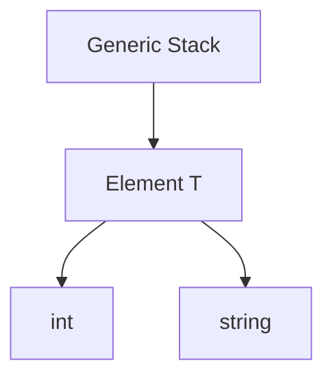

# TI.15 Generic Data Structures

## Mission

- Build type-safe collections (Stack, Queue, Set) using Go generics.
- Understand the internal mechanics of LIFO and FIFO data management.
- Implement unique sets using `map[T]struct{}` with `comparable` constraints.
- Manage generic state within receiver-based data structures.

## Prerequisites

- `TI.9` Generics

## Mental Model

In high-performance systems, reusable data structures are essential. Prior to generics, Go developers often relied on `interface{}` (now `any`) which required runtime type assertions and introduced potential performance bottlenecks. By utilizing type parameters, we can build specialized collections that are checked at compile-time, ensuring that a `Stack[int]` can only ever contain integers, with no runtime overhead.

## Visual Model



## Machine View

Generic data structures in Go are implemented through **monomorphization**. When you instantiate a `Stack[int]`, the compiler generates a specialized version of the struct and its methods specifically for the `int` type. This means the underlying slice operations (`append`, indexing) are as efficient as if they were written manually for `int`, avoiding the pointer chasing and interface boxing common in other languages.

## Run Instructions

```bash
go run ./04-types-design/15-generic-data-structures
```

## Code Walkthrough

### Generic Stack (LIFO)

A Stack manages items in a "Last-In-First-Out" order. The generic implementation ensures that the `Pop` method returns the correct type `T` without casting.

```go
type Stack[T any] struct {
    items []T
}
```

### Generic Set (comparable)

A Set requires the `comparable` constraint because it uses the internal map hashing mechanism to ensure uniqueness.

```go
type Set[T comparable] map[T]struct{}
```

## Try It

### Automated Tests

```bash
go test ./...
```

### Manual Verification

- Add a `Peek()` method to the `Stack` struct that returns the top element without removing it.
- Instantiate a `Queue` for a custom struct type (e.g., `Task`) and verify that it maintains FIFO order.

## In Production

- **Task Orchestrators**: Using generic queues to manage background work items.
- **Undo/Redo Systems**: Using generic stacks to store state history.
- **Deduplication Engines**: Using generic sets to filter unique identifiers or IPs.

## Thinking Questions

1. Why does the `Set` implementation require the `comparable` constraint?
2. What are the memory implications of using `struct{}` as a map value in a `Set`?
3. How does a generic data structure improve the "Zero-Magic" debugging experience compared to `any`?

---

## Next Step

Next: `TI.12` -> [`04-types-design/12-functional-options`](../12-functional-options/README.md)
