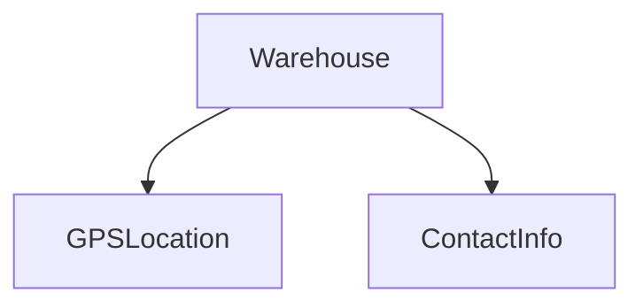

# CO.1 Composition

## Mission

- Build complex types using named-field composition.
- Understand the "has-a" relationship vs. the inheritance model.
- Access inner component methods through explicit dot notation.
- Design reusable domain components that maintain internal state.

## Prerequisites

- `TI.10` Payroll Processor Case Study

## Mental Model

Go deliberately omits class-based inheritance to avoid the tight coupling and fragility associated with deep type hierarchies. Instead, Go prioritizes **composition**, where complex types are constructed by aggregating smaller, focused components. This approach follows the "Composition over Inheritance" principle, ensuring that each component remains independent and its behavior is explicitly invoked by the parent.

## Visual Model



## Machine View

At the memory level, a composed struct stores its component structs as contiguous blocks of memory (if passed by value) or as pointers. There is no hidden "parent" link or virtual method table dispatch involved in named-field composition. Accessing a field like `warehouse.Location` is a direct offset calculation in memory, and calling `warehouse.Location.String()` is a standard function call where the receiver is the `Location` field.

## Run Instructions

```bash
go run ./04-types-design/16-composition
```

## Code Walkthrough

### Reusable Components

Components like `GPSLocation` and `ContactInfo` are defined as independent structs with their own method sets. They have no knowledge of the structures that will eventually contain them.

```go
type GPSLocation struct {
    Latitude, Longitude float64
}

func (g GPSLocation) String() string { ... }
```

### Named-Field Composition

The `Warehouse` type aggregates these components as named fields. This makes ownership and access explicit at every level of the code.

```go
type Warehouse struct {
    ID       int
    Location GPSLocation // Warehouse HAS a location
    Contact  ContactInfo // Warehouse HAS contact info
}
```

### Explicit Access

To use the behavior of a component, you must navigate the field hierarchy. This ensures there is no ambiguity about which type is providing the behavior.

```go
w.Location.String() // Explicit access
```

## Try It

### Automated Tests

```bash
go test ./...
```

### Manual Verification

- Add a new `Dimensions` component (Length, Width, Height) and compose it into the `Warehouse` struct.
- Verify that you can access the volume calculation via `w.Dimensions.Volume()`.

## In Production

- **Resource Metadata**: Attaching standard `CreatedAt` and `UpdatedAt` timestamps to domain models.
- **Microservices**: Composing common `AuthContext` or `Logger` components into service handlers.
- **Physical Modeling**: Building assets (Trucks, Planes, Warehouses) from shared physical attributes like `Position` or `LoadCapacity`.

## Thinking Questions

1. Why does Go's choice of composition over inheritance reduce "spaghetti" code in large projects?
2. How does explicit field access (`w.Location.String()`) improve the "Zero-Magic" debugging experience?
3. What happens to the method set of the parent struct when you add a component as a named field?

## Next Step

Next: `CO.2` -> [`04-types-design/17-embedding`](../17-embedding/README.md)
