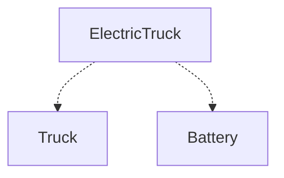

# CO.2 Embedding

## Mission

- Utilize struct embedding to promote fields and methods.
- Understand the mechanics of anonymous fields vs. named fields.
- Manage field shadowing and explicit name resolution.
- Leverage embedding for rapid type construction and interface satisfaction.

## Prerequisites

- `CO.1` Composition

## Mental Model

While standard composition is explicit, it can become verbose when a parent type needs to expose many behaviors of its internal components. **Embedding** (also known as anonymous field composition) allows a struct to include another type without a field name. This triggers "promotion," where the fields and methods of the embedded type become directly accessible on the parent struct, providing a clean syntax that resembles inheritance while maintaining the safety of composition.

## Visual Model



## Machine View

Embedding is essentially "syntax sugar" for composition. When you embed `TypeB` into `TypeA`, Go internally creates a field named `TypeB`. During compilation, if you access `a.FieldOfB`, the compiler automatically resolves this to `a.TypeB.FieldOfB`. This resolution happens at compile-time, meaning there is no runtime overhead or "virtual" lookup table involved. If both `TypeA` and `TypeB` have a field with the same name, the outer field (in `TypeA`) "shadows" the inner one, requiring an explicit path to reach the embedded field.

## Run Instructions

```bash
go run ./04-types-design/17-embedding
```

## Code Walkthrough

### Embedding Syntax

To embed a type, include only the type name in the struct definition without a field identifier.

```go
type Laptop struct {
    Dimensions // Embedded
    Battery    // Embedded
}
```

### Method Promotion

Methods from `Dimensions` (like `IsPortable`) are now part of the `Laptop` method set.

```go
l := Laptop{...}
l.IsPortable() // Promoted call
```

### Field Shadowing

If names collide, the outermost field wins. The embedded field is still accessible via its type name.

```go
type Tablet struct {
    Battery
    ChargeLevel string // Shadows Battery.ChargeLevel
}

t.ChargeLevel         // string
t.Battery.ChargeLevel // int
```

## Try It

### Automated Tests

```bash
go test ./...
```

### Manual Verification

- Add a method `PowerSummary()` to the `Battery` struct.
- Verify that you can call `laptop.PowerSummary()` directly without referencing the `Battery` field.
- Add a `Model` field to the `Battery` struct and observe how it is shadowed if the `Laptop` struct also has a `Model` field.

## In Production

- **Custom Error Types**: Embedding `error` or standard library types to extend their behavior.
- **Middleware Design**: Embedding `http.Request` or `http.ResponseWriter` to add metadata or logging capabilities.
- **API Clients**: Embedding a `BaseClient` that handles authentication and retries into specialized service clients.

## Thinking Questions

1. How does embedding differ from class inheritance in languages like Java or C++?
2. What are the risks of deep embedding hierarchies (e.g., A embeds B, B embeds C)?
3. Why does field shadowing occur, and how does it prevent the "Fragile Base Class" problem?

## Next Step

Next: `CO.3` -> [`04-types-design/18-bank-account-project`](../18-bank-account-project/README.md)
